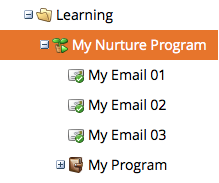

# 了解参与项目 {#understanding-engagement-programs}

参与项目旨在通过系统化的方式向新受众呈现内容，从而开展营销。

>[!NOTE]
>
>每个订阅最多只能有 100 个&#x200B;**处于活跃状态的**&#x200B;参与项目。

## 参与项目 {#engagement-program}

**参与项目**&#x200B;是一种可轻松实现复杂培育流程的项目类型。

>[!MORELIKETHIS]
>
>[创建参与项目](/help/marketo/product-docs/email-marketing/drip-nurturing/creating-an-engagement-program/create-an-engagement-program.md)

## 流 {#stream}

**流**&#x200B;是一个按优先级组织的内容池，参与项目会使用它来培育人员。

>[!MORELIKETHIS]
>
>* [添加流](/help/marketo/product-docs/email-marketing/drip-nurturing/creating-an-engagement-program/add-a-stream.md)
>* [克隆流](/help/marketo/product-docs/email-marketing/drip-nurturing/engagement-program-streams/clone-a-stream.md)

## 内容 {#content}

您可以向参与项目的流中添加两种类型的&#x200B;**内容**：电子邮件和项目。电子邮件会在执行投放时发送给人员。

>[!MORELIKETHIS]
>
>* [向流中添加内容](/help/marketo/product-docs/email-marketing/drip-nurturing/creating-an-engagement-program/add-content-to-a-stream.md)
>* [优先处理流内容](/help/marketo/product-docs/email-marketing/drip-nurturing/using-stream-content/prioritize-stream-content.md)
>* [编辑流内容的可用性](/help/marketo/product-docs/email-marketing/drip-nurturing/using-stream-content/edit-availability-of-stream-content.md)
>* [移除流内容](/help/marketo/product-docs/email-marketing/drip-nurturing/using-stream-content/remove-stream-content.md)
>* [归档和取消归档流内容](/help/marketo/product-docs/email-marketing/drip-nurturing/using-stream-content/archive-and-unarchive-stream-content.md)

## 投放 {#cast}

**投放**&#x200B;是指从参与项目中发送电子邮件的事件。

>[!NOTE]
>
>参与项目并非用于发送运营类电子邮件。

## 流节奏 {#stream-cadence}

您可以通过设置&#x200B;**流节奏**&#x200B;来决定投放发生的时间。这是用于按固定时间间隔安排内容发送的方式。

>[!MORELIKETHIS]
>
>[设置流节奏](/help/marketo/product-docs/email-marketing/drip-nurturing/engagement-program-streams/set-stream-cadence.md)

## 人员节奏 {#person-cadence}

**人员节奏**&#x200B;是一种状态，用于定义某位人员是否可以从参与项目中接收内容。您可以使用 **[!UICONTROL Change Engagement Program Cadence]** 流程步骤，将其更改为 [!UICONTROL Paused] 或 [!UICONTROL Normal]。

## 已耗尽 {#exhausted}

当某位人员已接收该流中的所有内容后，该人员会被标记为&#x200B;**已耗尽**。

>[!MORELIKETHIS]
>
>[已耗尽内容的人员](/help/marketo/product-docs/email-marketing/drip-nurturing/using-engagement-programs/people-who-have-exhausted-content.md)

## 内容参与度等级 {#content-engagement-level}

内容参与度等级是 Marketo 为您的内容分配的一个 0 到 100 的评分。该评分通过一套复杂的计算公式得出，综合考虑了打开率、点击率、取消订阅、项目成功情况等多种因素。

>[!MORELIKETHIS]
>
>[了解参与评分](/help/marketo/product-docs/email-marketing/drip-nurturing/reports-and-notifications/understanding-the-engagement-score.md)
