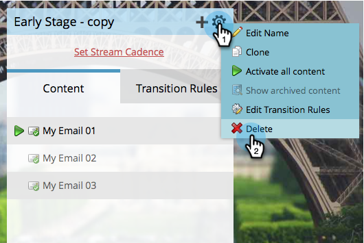
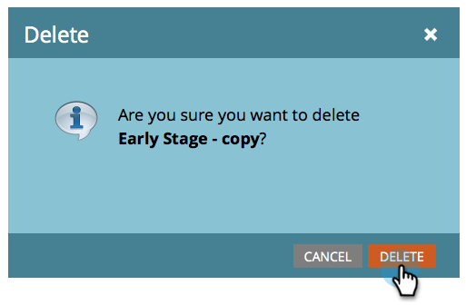

# 删除流 {#delete-a-stream}

如果您需要从参与计划中删除流，请按照这些快速而简单的步骤操作。

1. 前往 **[!UICONTROL Marketing Activities]**。

   

1. 选择您的参与计划并转到&#x200B;**[!UICONTROL Streams]**。

   

   >[!CAUTION]
   >
   >删除流将导致该流中内容的历史数据丢失。

1. 单击齿轮图标并选择&#x200B;**[!UICONTROL Delete]**。

   

1. 单击&#x200B;**[!UICONTROL Delete]**&#x200B;确认删除。

   

   >[!NOTE]
   >
   >如果流中有人，将要求您先[将他们](/help/marketo/product-docs/core-marketo-concepts/smart-campaigns/program-flow-actions/change-engagement-program-stream.md)移出。
