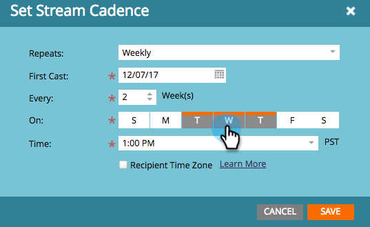
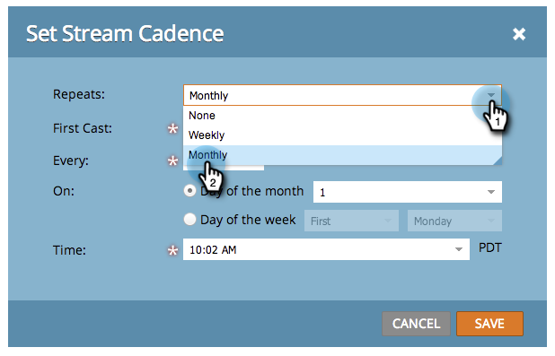

# 设置流频率 {#set-stream-cadence}

您可以按任意所需的间隔发送参与内容。 例如：每周一次，或每月每三分之一的星期二。

## 设置频度 {#set-cadence}

1. 转到 **营销活动**.

   

1. 查找并选择您的参与计划，单击 **流** ，然后单击 **设置流频率**.

   

1. 选择希望频度重复的频率。 您可以选择 **每周** 或 **每月**.

## 每周 {#weekly}

1. 选择 **每周**.

   

   >[!NOTE]
   >
   >选择 **无** 会把溪流关掉。

1. 选择第一次投票的日期。

   

1. 现在，选择您希望每周发生一次，还是间隔更远。 我们每两周选一次。

   

1. 决定一周中的哪几天。 在本例中，我们将在星期二、星期三和星期四执行。

   

   >[!TIP]
   >
   >您可以通过选择 **重复：每周** / **每：1周** / **开**:整天。

   现在选时间。 如果要使用，请勾选方框 [收件人时区](/help/marketo/product-docs/email-marketing/drip-nurturing/engagement-program-streams/set-stream-cadence/schedule-engagement-programs-with-recipient-time-zone.md)（即，根据当地时区交付），然后单击 **保存**.

   

   >[!CAUTION]
   >
   >内容将在您为首次播放选择的日期发出，因此请确保内容与您选择的一周中的某一天一致；否则，第一周就会出两次。

1. 将鼠标悬停在频率上。 你会看到未来的投票日期。

   

   >[!NOTE]
   >
   >在本例中，星期四将发出一封电子邮件。 然后，我们跳过一周，并在下周的星期二、星期三和星期四再次发送。 然后我们再次循环。

就这样！ 如果要设置每月频率，请继续阅读。

## 每月 {#monthly}

1. 选择 **每月** 重复的频率。

   

1. 选择第一次投票的日期。

   

1. 选择希望它每月或更多间隔……我们每四个月选一次。

   

1. 选择指定的月份的哪个日期，在此例中为每四月的22日。

   

   >[!TIP]
   >
   >或者，您也可以选择一周中的某一天。

1. 选择 **时间** 单击 **保存**.

   

1. 将鼠标悬停在频率上。 你会看到未来的投票日期。

   

   >[!CAUTION]
   >
   >如果您决定稍后修改参与流频率，请确保将首次播放设置为将来的日期。

现在你知道如何设置流频率！

>[!MORELIKETHIS]
>
>* [了解收件人时区](/help/marketo/product-docs/email-marketing/email-programs/email-program-actions/scheduling-with-recipient-time-zone/understanding-recipient-time-zone.md)
>* [按收件人时区计划参与计划](/help/marketo/product-docs/email-marketing/drip-nurturing/engagement-program-streams/set-stream-cadence/schedule-engagement-programs-with-recipient-time-zone.md)

