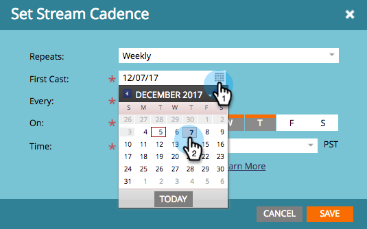
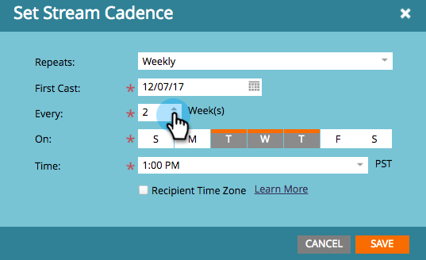
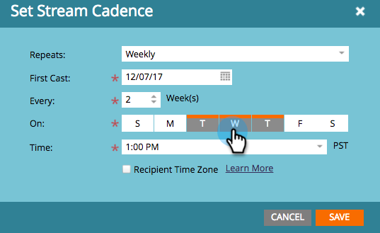
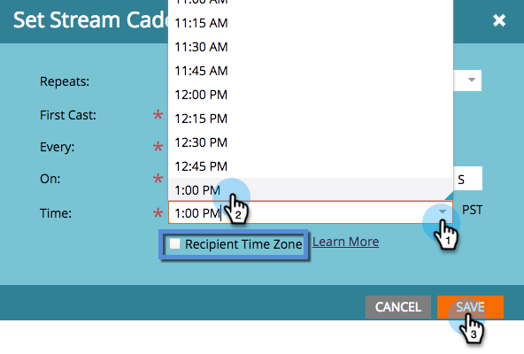
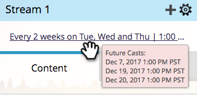
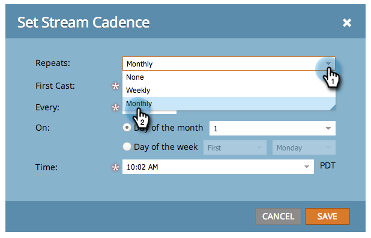
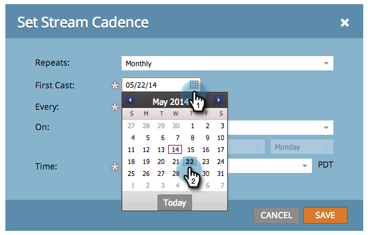
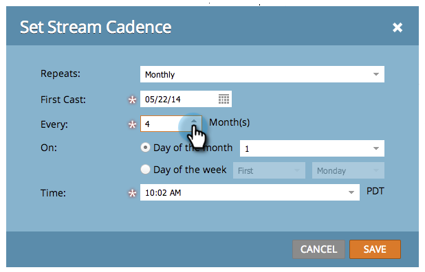
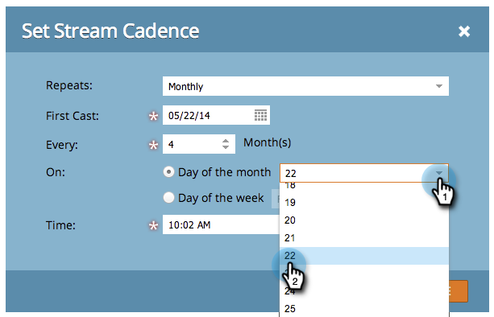

# 设置流发送节奏 {#set-stream-cadence}

您可以按所需的任何间隔发送参与内容。 例如：每周一次，或每月每三个星期二。

## 设置节奏 {#set-cadence}

1. 前往 **[!UICONTROL Marketing Activities]**。

   

1. 查找并选择您的参与计划，单击&#x200B;**[!UICONTROL Streams]**&#x200B;选项卡，然后单击&#x200B;**[!UICONTROL Set Stream Cadence]**。

   

1. 选择您希望节奏再现的频率。 您可以选择&#x200B;**[!UICONTROL Weekly]**&#x200B;或&#x200B;**[!UICONTROL Monthly]**。

## 每周 {#weekly}

1. 选择 **[!UICONTROL Weekly]**。

   

   >[!NOTE]
   >
   >选择&#x200B;**[!UICONTROL None]**&#x200B;将关闭流。

1. 选择第一次演出的日期。

   

1. 现在，选择您希望节奏每周发生还是间隔更长。 每2周挑一次。

   

1. 决定一周的哪几天。 在这种情况下，选择星期二、星期三和星期四。

   

   >[!TIP]
   >
   >您可以通过选择&#x200B;**[!UICONTROL Repeats]：[!UICONTROL Weekly]** / **[!UICONTROL Every]： 1[!UICONTROL Week]** / **[!UICONTROL On]**：所有天数将您的节奏设置为每天运行。

   现在选择时间。 如果要使用[收件人时区](/help/marketo/product-docs/email-marketing/drip-nurturing/engagement-program-streams/set-stream-cadence/schedule-engagement-programs-with-recipient-time-zone.md)（即根据本地时区投放），请选中该框，然后单击&#x200B;**[!UICONTROL Save]**。

   

   >[!CAUTION]
   >
   >内容将在您为首次播放选择的日期发出，因此请确保它与您选择的一周中的某一天一致；否则，内容将在第一周发出两次。

1. 将鼠标悬停在节奏上。 未来发生剧变的日子即将到来。

   

   >[!NOTE]
   >
   >在此示例中，电子邮件将在星期四发出。 跳过了下周，电子邮件又在一周的周二、周三和周四发送。 然后循环就会重复。

## 每月 {#monthly}

1. 选择&#x200B;**[!UICONTROL Monthly]**&#x200B;作为重复频率。

   

1. 选择第一次演出的日期。

   

1. 选择您希望它每月间隔一次还是间隔更长时间。 每四个月选一次。

   

1. 选择您指定的月份日期，在本例中是每四个月的22号。

   

   >[!TIP]
   >
   >或者，您可以选择一周的某天。

1. 选择&#x200B;**[!UICONTROL Time]**&#x200B;并单击&#x200B;**[!UICONTROL Save]**。

   

1. 将鼠标悬停在节奏上。 未来发生剧变的日子即将到来。

   

   >[!CAUTION]
   >
   >如果您决定稍后修改参与流节奏，请确保将首次强制转换设置为未来的日期。

现在您知道如何设置流节奏了。

>[!MORELIKETHIS]
>
>* [了解收件人时区](/help/marketo/product-docs/email-marketing/email-programs/email-program-actions/scheduling-with-recipient-time-zone/understanding-recipient-time-zone.md)
>* [按照收件人时区安排参与计划](/help/marketo/product-docs/email-marketing/drip-nurturing/engagement-program-streams/set-stream-cadence/schedule-engagement-programs-with-recipient-time-zone.md)
