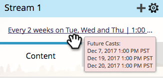

# 设置流节奏 {#set-stream-cadence}

您可以按任意时间间隔发送参与内容。 例如：每周一次，或每三个星期二一次。

## 设置节奏 {#set-cadence}

1. 转到营 **销活动**。

   

1. 查找并选择您的参与项目，单击**流**选项卡，然后单击“设置流 **节奏”**。

   

1. 选择希望节奏重复的频率。 您可以选择**每周**或每 **月**。

## 每周 {#weekly}

1. 选择 **每周**。

   

   >[!NOTE]
   >
   >选择**无**将关闭流。

1. 选择第一次演出的日期。

   

1. 现在，选择您希望节奏每周发生一次还是间隔更长。 我们每两周选一次。

   

1. 确定一周的哪几天。 在这个例子中，我们在星期二、星期三和星期四进行。

   

   >[!TIP]
   >
   >您可以通过选择“重复”来设置节奏以每天 **运行：每周** /**每：1周**/***开&#x200B;**始**:所有日子。

   现在选择时间。 如果要使用收件人时 [区](set-stream-cadence/schedule-engagement-programs-with-recipient-time-zone.md)（即根据本地时区传送），请选中此框，然后单击保存。
   

   >[!CAUTION]
   >
   >内容将在您为第一次播放选择的日期发布，因此请确保它与您选择的周的日期一致；否则第一周会出两次。

1. 将指针悬停在节奏上。 你会看到未来的日子。

   

   >[!NOTE]
   >
   >在此示例中，将在星期四发出电子邮件。 然后，我们跳过一周，在下周的星期二、星期三和星期四再次发送。 然后我们再次循环。

就这样！ 如果要设置月度节奏，请继续阅读。

## 每月 {#monthly}

1. 选择“**每月**”以确定重复频率。

   

1. 选择第一次演出的日期。

   

1. 选择是否希望它每月间隔更长……我们每四个月选一次。

   

1. 选择指定月份的哪一天，在这种情况下为每四个月的22天。

   

   >[!TIP]
   >
   >或者，您也可以选择一周中的某一天。

1. 选择一个 **时间** ，然后单 **击保存**。

   

1. 将指针悬停在节奏上。 你会看到未来的日子。

   

   >[!CAUTION]
   >
   >如果您决定稍后修改参与流节奏，请确保将第一个播放设置为将来的日期。

现在你知道如何设置流节奏了！

>[!MORELIKETHIS]
>
>* [了解收件人时区](../../../../product-docs/email-marketing/email-programs/email-program-actions/scheduling-with-recipient-time-zone/understanding-recipient-time-zone.md)
>* [计划项目与收件人时区](set-stream-cadence/schedule-engagement-programs-with-recipient-time-zone.md)

>

