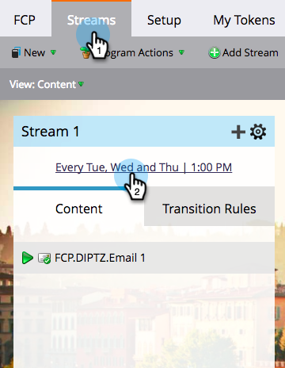

# 按照收件人时区安排参与计划 {#schedule-engagement-programs-with-recipient-time-zone}

当您计划参与项目项目流并且收件人时区处于活动状态时，项目转换将在第一个时区的午夜开始运行(UTC +14:00)。 我们要求您安排第一次点播 **至少25小时** 因为将来全球每个时区都有一些人有资格参演。 在第一个时区中的此时开始处理，可以保证我们会在计划的日期和时间为每个收件人发送电子邮件。

1. 在您的参与计划中，导航到 **流** 选项卡，然后单击流的节奏计划以进行编辑。

   

1. [设置节奏设置](/help/marketo/product-docs/email-marketing/drip-nurturing/engagement-program-streams/set-stream-cadence.md) 与往常一样，然后检查 **收件人时区** 盒子。 请记住，您的第一个演员必须在未来至少25小时投放。 单击 **保存**.

   

1. 请注意，在收件人时区处于活动状态的情况下，节奏计划不会显示特定时区，因为可能会有多个时区。 它只显示小时。

   

>[!MORELIKETHIS]
>
>* [了解收件人时区](/help/marketo/product-docs/email-marketing/email-programs/email-program-actions/scheduling-with-recipient-time-zone/understanding-recipient-time-zone.md)
>* [设置流节奏](/help/marketo/product-docs/email-marketing/drip-nurturing/engagement-program-streams/set-stream-cadence.md)
