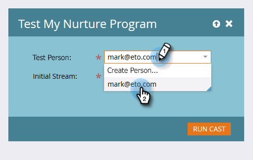

# 测试参与流{#test-an-engagement-stream}

将所有内容添加到流后，您可以一次测试它们一个部分。

1. 转到&#x200B;**营销活动**。

   

1. 选择您的参与项目。

   

1. 单击&#x200B;**项目操作**&#x200B;并选择&#x200B;**测试流**。

   

1. 从&#x200B;**测试人员**&#x200B;下拉列表中选择您的人员。 请记住，内容实际上会消失，因此在选择时请牢记这一点。

   

   >[!CAUTION]
   >
   >确保测试人员是唯一的，且数据库中没有重复。

   >[!TIP]
   >
   >如果要查找的测试人员不存在，请使用&#x200B;**创建人员**&#x200B;选项即时创建一个。

   单击“初始流”，选择要测试的流，然后单击“运行转换”。
   

1. 在人员完成之前设置的[过渡规则](/help/marketo/product-docs/email-marketing/drip-nurturing/engagement-program-streams/transition-people-between-engagement-streams.md)后，单击“刷新”图标。

   

1. 将显示新流，表示测试成功。

   

   干得好！

   >[!NOTE]
   >
   >除非您单击&#x200B;**再次运行Cast**，否则不会发送其他内容。
