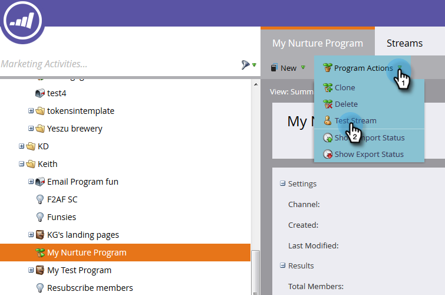

# 测试参与流 {#test-an-engagement-stream}

将所有内容添加到流后，即可一次测试一个内容。

1. 转到 **营销活动**.

   

1. 选择您的参与计划。

   

1. 单击 **项目操作** 并选择 **测试流**.

   

1. 从中选择您的人员 **测试人员** 下拉菜单。 请记住，内容将实际发出，因此在选择时请牢记这一点。

   

   >[!CAUTION]
   >
   >确保您的测试人员是唯一的，并且数据库中没有重复项。

   >[!TIP]
   >
   >如果您要查找的测试人员不存在，请使用 **创建人员** 选项动态创建一个。

   单击“Initial Stream（初始流）” ，选择要测试的流，然后单击“Run Cast（运行转换）”。
   

1. 在人员完成 [过渡规则](/help/marketo/product-docs/email-marketing/drip-nurturing/engagement-program-streams/transition-people-between-engagement-streams.md) 您之前已设置，请单击“刷新”图标。

   

1. 将显示新流，指示测试成功。

   

   做得好！

   >[!NOTE]
   >
   >除非您单击，否则不会发送其他内容 **再次运行转换**.
