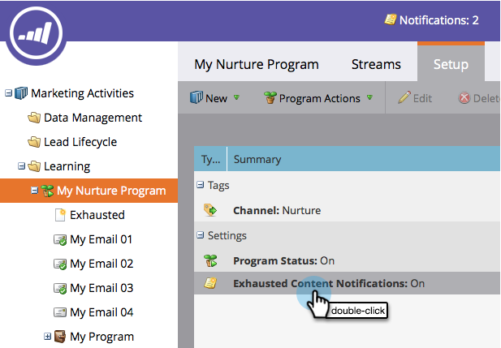

# 禁用和启用内容耗尽通知 {#disable-and-enable-exhausted-content-notifications}

当人们耗尽流中的所有内容时，Marketo可以向您发送通知。 您可以根据需要禁用/启用通知。 操作方法如下：

1. 前往 **[!UICONTROL Marketing Activities]**。

   

1. 选择参与计划并单击&#x200B;**[!UICONTROL Setup]**&#x200B;选项卡。

   

1. 双击&#x200B;**[!UICONTROL Exhausted Content Notifications]**。

   

1. 选择&#x200B;**[!UICONTROL Off]** （或&#x200B;**[!UICONTROL On]**）并单击&#x200B;**[!UICONTROL Save]**。

   

   太棒了！ 如果启用通知，您将在流本身看到一些内容，并收到电子邮件通知。
