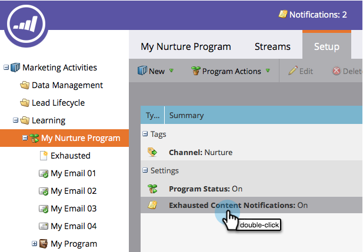

# 禁用和启用已用尽的内容通知 {#disable-and-enable-exhausted-content-notifications}

当用户用尽流中的所有内容时，Marketo可以向您发送通知。 您可以根据需要禁用/启用通知。 这是方法。

1. 转到 **营销活动**.

   

1. 选择参与项目，然后单击 **设置** 选项卡。

   

1. 双击 **已用尽的内容通知**.

   

1. 选择 **关闭** (或 **开**)并单击 **保存**.

   

   超级！ 如果启用通知，您将在流本身上看到某些内容，并会收到电子邮件通知。
