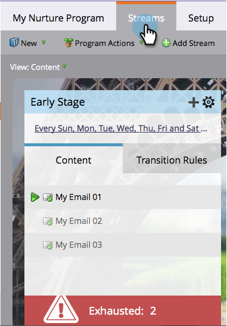

# 已耗尽内容的人{#people-who-have-exhausted-content}

当用户收到流中的每一条内容时，它已用尽了所有可能性，并将等待空闲，直到添加更多内容。 你可以从几种方式找到“精疲力尽”的人。

## 参与项目筛选器成员{#member-of-engagement-program-filter}

1. 创建新的智能列表，然后在&#x200B;**参与项目成员**&#x200B;过滤器中查找并拖动。

   

1. 查找并选择参与项目，在其中查找精疲力尽的人员。

   

1. 在&#x200B;**添加约束**&#x200B;下，选择&#x200B;**已用尽的内容**。

   

1. 将&#x200B;**用完的内容**&#x200B;设置为&#x200B;**true**。

   

   只需运行此智能列表，即可查看已用尽其所有内容的用户的列表。

## 成员选项卡{#members-tab}

1. 转到&#x200B;**营销活动**。

   

1. 选择您的参与项目并转到&#x200B;**成员**&#x200B;选项卡。

   

1. 请注意名为&#x200B;**已用尽的内容**&#x200B;的列。

   

   这向您显示已用尽所有内容的人和尚未用尽内容的人。

## 流{#stream}

1. 您还可以在流本身的“流”选项卡下查看已用尽内容的总人数。

   

   >[!NOTE]
   >
   >此数字将在每次转换后立即更新。
