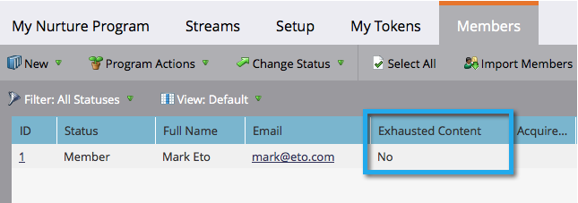

# 已耗尽内容的人 {#people-who-have-exhausted-content}

当个人收到流中的每段内容时，它就会耗尽所有可能性，并等待空闲直到添加更多内容。 你可以在几个方面找到“精疲力竭”的人。

## 参与计划筛选的成员 {#member-of-engagement-program-filter}

1. 创建新的智能列表，然后在 **参与计划成员** 筛选。

   

1. 查找并选择要在其中查找已耗竭人员的参与计划。

   

1. 下 **添加约束**，选择 **已用完的内容**.

   

1. 设置 **已用完的内容** 到 **true**.

   

   只需运行此智能列表即可查看已用完其所在流中所有内容的人员的列表。

## “成员”选项卡 {#members-tab}

1. 转到 **营销活动**.

   

1. 选择您的参与计划，然后转到 **成员** 选项卡。

   

1. 请注意名为 **已用完的内容**.

   

   这会向您显示已用完所有内容的人和未用完内容的人。

## 串流 {#stream}

1. 您还可以在流本身的“流”选项卡下查看已用完内容的总人数。

   

   >[!NOTE]
   >
   >此数字将在每次强制转换后立即更新。
