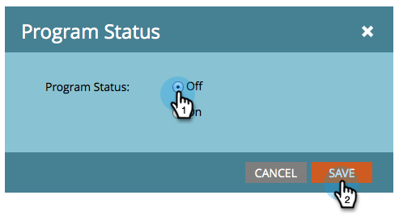

# 打开和关闭参与计划 {#turn-an-engagement-program-on-and-off}

只需轻轻一按开关，即可关闭参与计划。 这将阻止发送任何内容。 具体方法如下。

1. 转到 **营销活动**.

   

1. 选择参与计划并单击 **设置**.

   >[!NOTE]
   >
   >除非您超出订阅限制，否则默认情况下，参与计划处于打开状态。

   

1. 双击 **项目状态**.

   

1. 选择 **关闭** 并单击 **保存**.

   

好了！ 您可以使用相同的步骤将其重新打开。
