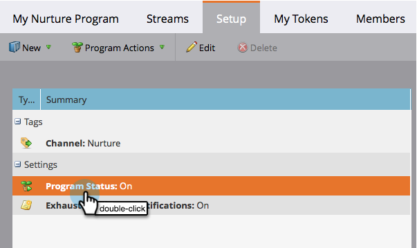
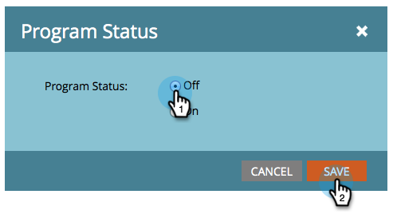

# 启用或关闭参与计划 {#turn-an-engagement-program-on-and-off}

只需轻轻一按开关，即可关闭参与计划。 这将阻止发送任何内容。 操作方法如下：

1. 前往 **[!UICONTROL Marketing Activities]**。

   

1. 选择参与计划并单击&#x200B;**[!UICONTROL Setup]**。

   >[!NOTE]
   >
   >除非您超出订阅限制，否则默认情况下，参与计划处于打开状态。

   

1. 双击&#x200B;**[!UICONTROL Program Status]**。

   

1. 选择 **[!UICONTROL Off]** 并点击 **[!UICONTROL Save]**。

   

好了！ 您可以使用相同的步骤将其重新打开。
