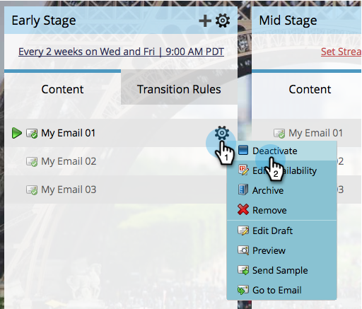

# 激活和停用流内容 {#activate-and-deactivate-stream-content}

默认情况下，流内容为OFF。 激活内容以在参与度投放期间发送它们。

## 激活流内容 {#activate-stream-content}

1. 前往 **[!UICONTROL Marketing Activities]**。

   

1. 选择您的参与计划并单击&#x200B;**[!UICONTROL Streams]**&#x200B;选项卡。

   

1. 将鼠标悬停在要激活的内容上，单击齿轮图标，然后单击&#x200B;**[!UICONTROL Activate]**。

   >[!NOTE]
   >
   >电子邮件必须获得批准才能激活。

   

   >[!TIP]
   >
   >您还可以通过单击顶级的齿轮图标，然后单击&#x200B;**[!UICONTROL Activate all content]**&#x200B;来激活流中的所有内容。

## 取消激活流内容 {#deactivate-stream-content}

1. 选择您的参与计划并单击&#x200B;**[!UICONTROL Streams]**&#x200B;选项卡。

   

1. 将鼠标悬停在要取消激活的内容上，单击齿轮图标，然后单击&#x200B;**[!UICONTROL Deactivate]**。

   
