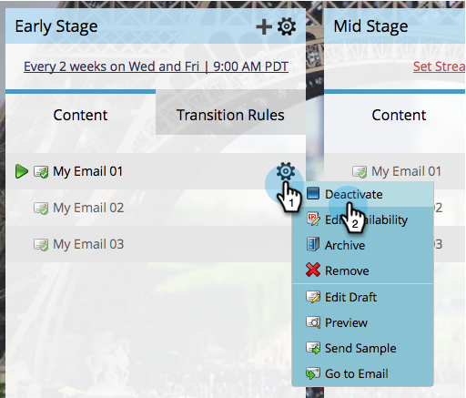

# 激活和取消激活流内容 {#activate-and-deactivate-stream-content}

默认情况下，流内容为OFF。 激活内容以在参与投放期间将其发送。

## 激活流内容 {#activate-stream-content}

1. 转到 **营销活动**.

   

1. 选择您的参与计划，然后单击 **流** 选项卡。

   

1. 将鼠标悬停在要激活的内容上，单击齿轮图标，然后单击 **激活**.

   >[!NOTE]
   >
   >电子邮件必须获得批准才能激活。

   

   >[!TIP]
   >
   >您还可以通过单击顶层的齿轮图标，然后单击 **激活所有内容**.

   做得不错！现在您知道如何激活流中的内容了。

## 取消激活流内容 {#deactivate-stream-content}

1. 选择您的参与计划，然后单击 **流** 选项卡。

   

1. 将鼠标悬停在要取消激活的内容上，单击齿轮图标，然后单击 **取消激活**.

   
