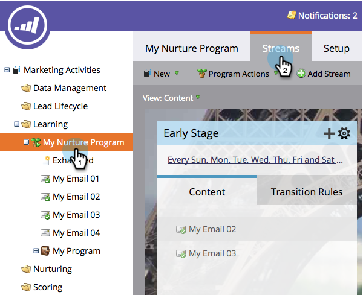

# 存档和取消存档流内容 {#archive-and-unarchive-stream-content}

如果您不想再在流中使用一段内容，则可以 [删除](/help/marketo/product-docs/email-marketing/drip-nurturing/using-stream-content/remove-stream-content.md) 或将其存档。 下面是如何存档内容。

>[!TIP]
>
>删除操作会破坏所有相关的历史记录；存档保留它。

## 存档流内容 {#archive-stream-content}

1. 选择您的参与计划，然后转到 **流** 选项卡。

   

1. 将鼠标悬停在要存档的电子邮件上，然后在齿轮图标下单击 **存档**.

   

   就这样！ 记住，如果要保留历史，请存档。

## 取消存档流内容 {#unarchive-stream-content}

1. 选择您的参与计划，然后转到 **流** 选项卡。

   

1. 单击流的齿轮图标，然后单击 **显示存档内容**.

   

1. 现在，您可以看到已存档的内容，请单击要取消存档的内容的齿轮图标，然后单击 **取消存档**.

   

   完美！ 现在，可以按优先级排列并激活此内容。
