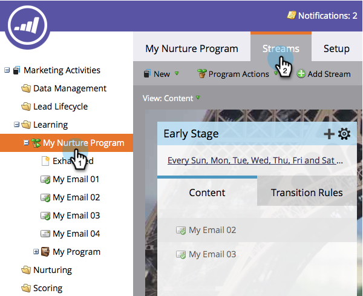
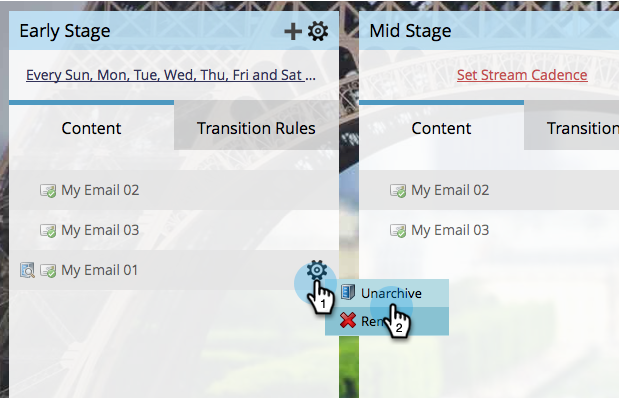

# 归档和取消归档流内容 {#archive-and-unarchive-stream-content}

如果您不再希望在流中使用某段内容，可以[将其删除](/help/marketo/product-docs/email-marketing/drip-nurturing/using-stream-content/remove-stream-content.md)或将其存档。 以下是存档内容的方法。

>[!TIP]
>
>删除将销毁所有关联的历史记录；存档可保留历史记录。

## 将流内容存档 {#archive-stream-content}

1. 选择您的参与计划，然后转到&#x200B;**[!UICONTROL Streams]**&#x200B;选项卡。

   

1. 将鼠标悬停在要存档的电子邮件上，然后在齿轮图标下单击&#x200B;**[!UICONTROL Archive]**。

   

   存档（如果要保留历史记录）。

## 取消存档流内容 {#unarchive-stream-content}

1. 选择您的参与计划，然后转到&#x200B;**[!UICONTROL Streams]**&#x200B;选项卡。

   

1. 单击流的齿轮图标，然后单击&#x200B;**[!UICONTROL Show archived content]**。

   

1. 现在您可以看到存档的内容，单击要取消存档的内容的齿轮图标，然后单击&#x200B;**[!UICONTROL Unarchive]**。

   

   现在，可以优先和激活此内容。
