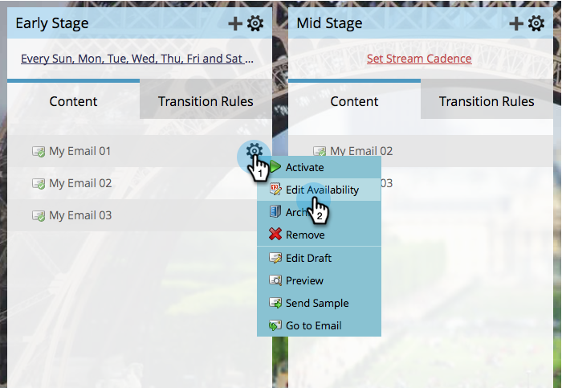

# 编辑流内容的可用性 {#edit-availability-of-stream-content}

您可以设置内容在流中处于活动状态的时间范围。 操作方法如下：

1. 选择您的参与计划，然后转到&#x200B;**[!UICONTROL Streams]**&#x200B;选项卡。

   

1. 单击要计划的内容部分的齿轮图标，然后选择&#x200B;**[!UICONTROL Edit Availability]**。

   

1. 选择您的&#x200B;**[!UICONTROL Active From]**&#x200B;日期，然后选择&#x200B;**[!UICONTROL Active Through]**&#x200B;日期，然后单击&#x200B;**[!UICONTROL Save]**。

   

   >[!TIP]
   >
   >您可以将&#x200B;**[!UICONTROL Active Through]**&#x200B;保留为空以使内容永久可用。

   完美！ 您将在计划内容旁边看到时钟图标。 它会根据您设置的计划变为活动和非活动。

   
