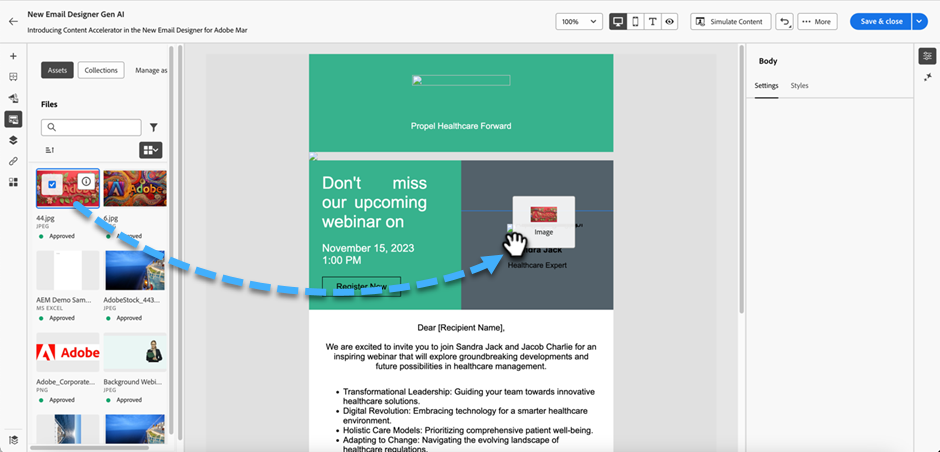

# 使用Experience Manager资源 {#work-with-experience-manager-assets}

当&#x200B;_Adobe Experience Manager Assetsas a Cloud Service_&#x200B;与Adobe Marketo Engage集成时，您可以轻松访问数字资源以用于营销内容。 创作内容时，可从左侧导航栏中的&#x200B;_[!UICONTROL Experience Manager Assets]_&#x200B;项访问资源。

>[!PREREQUISITES]
>
>连接MKTO/AEM文档。

>[!NOTE]
>
>目前，Marketo Engage仅支持&#x200B;_Adobe Experience Manager Assets_&#x200B;中的图像资源。 必须在Adobe Experience Manager Assets中央存储库中更改资源。 [了解详情](https://experienceleague.adobe.com/en/docs/experience-manager-cloud-service/content/assets/manage/manage-digital-assets)

当您使用这些数字资源时，_Assetsas a Cloud Service_&#x200B;中的最新更改会通过链接的引用自动传播到实时电子邮件促销活动。 如果在&#x200B;_Adobe Experience Manager Assetsas a Cloud Service_&#x200B;中删除了图像，则这些图像在电子邮件中会以损坏的引用出现。 当当前在Marketo Engage中使用的资源被修改或删除时，会通知电子邮件作者图像发生了更改。 对资源的所有更改必须在Adobe Experience Manager Assets中央存储库中完成。

## 使用AEM Assets作为图像源 {#use-aem-assets-as-the-image-source}

如果您的环境有一个或多个资源存储库连接，则在创建或查看电子邮件、电子邮件模板或可视化片段的详细信息时，可以指定AEM Assets作为资源的源。

* 创建新内容时，在对话框中选择`AEM Assets`作为&#x200B;**[!UICONTROL Image Source]**&#x200B;项。

{width="400"}

* 打开现有内容资源时，请在右侧的&#x200B;_[!UICONTROL 正文]_&#x200B;部分中选择`AEM Assets`。

{width="700" zoomable="yes"}

## 访问资源以进行创作 {#access-assets-for-authoring}

>[!IMPORTANT]
>
>管理员必须将需要访问资源的用户添加到Assets Consumer Users和/或Assets Users产品配置文件。 [了解详情](https://experienceleague.adobe.com/en/docs/experience-manager-cloud-service/content/security/ims-support#managing-products-and-user-access-in-admin-console)

在可视内容编辑器中，单击左侧边栏中的&#x200B;_Experience Manager资源选择器_&#x200B;图标。 这会将“工具”面板更改为选定存储库中可用资源的列表。

{width="700" zoomable="yes"}

如果您有多个连接的AEM存储库，请单击&#x200B;**[!UICONTROL 管理为]**&#x200B;按钮选择要使用的存储库。

{width="700" zoomable="yes"}

选择所需的存储库。

有多种方法可以将图像资产添加到可视画布：

* 从左侧导航中拖放图像缩略图。

{width="700" zoomable="yes"}

* 将图像组件添加到画布并单击&#x200B;**[!UICONTROL 浏览]**&#x200B;以打开&#x200B;_[!UICONTROL 选择Assets]_&#x200B;对话框。

  从该对话框中，可以从所选存储库中选择图像。

  有多个工具可帮助您找到所需的资源。

{width="700" zoomable="yes"}

* 更改右上角的&#x200B;**[!UICONTROL 存储库]**。

* 单击右上角的&#x200B;**[!UICONTROL 管理资源]**&#x200B;可在其他浏览器选项卡中打开Assets存储库并使用AEM Assets管理工具。

* 单击右上角的&#x200B;_视图类型_&#x200B;选择器以将显示更改为&#x200B;**[!UICONTROL 列表视图]**、**[!UICONTROL 网格视图]**、**[!UICONTROL 图库视图]**&#x200B;或&#x200B;**[!UICONTROL 瀑布视图]**。

* 单击&#x200B;_排序顺序_&#x200B;图标可在升序和降序之间更改排序顺序。

* 单击&#x200B;**[!UICONTROL 排序方式]**&#x200B;菜单箭头以将排序条件更改为&#x200B;**[!UICONTROL 名称]**、**[!UICONTROL 大小]**&#x200B;或&#x200B;**[!UICONTROL 修改时间]**。

* 单击左上角的&#x200B;_筛选器_&#x200B;图标以根据您的条件筛选显示的项目。

* 在搜索字段中输入文本，以筛选显示的项目以匹配资源名称。

{width="700" zoomable="yes"}
