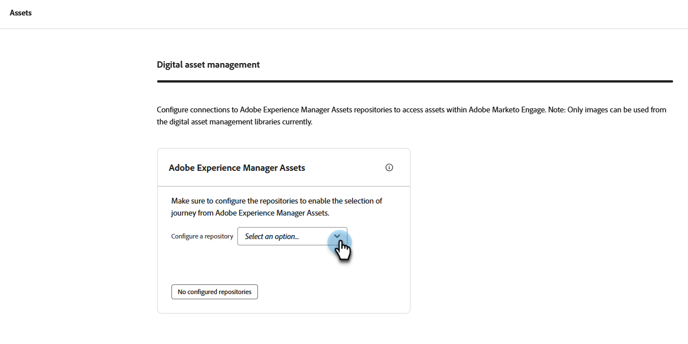
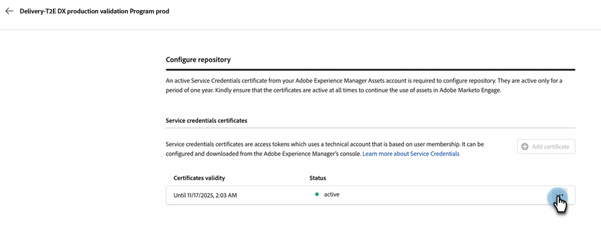

# 使用Experience Manager资源 {#work-with-experience-manager-assets}

将您的&#x200B;_Adobe Experience Manager Assets as a Cloud Service_&#x200B;帐户连接到Adobe Marketo Engage实例，以便您可以在Marketo Engage Email Designer中利用AEM资源存储库。

>[!NOTE]
>
>目前，Marketo Engage仅支持&#x200B;_Adobe Experience Manager Assets_&#x200B;中的图像资源。 必须在Adobe Experience Manager Assets中央存储库中更改资源。 [了解详情](https://experienceleague.adobe.com/en/docs/experience-manager-cloud-service/content/assets/manage/manage-digital-assets){target="_blank"}

## 链接到您的AEM云服务 {#link-to-your-aem-cloud-services}

在可以使用此功能之前，必须首先将AEM云服务与Adobe Marketo Engage关联。

+++链接AEM云服务和Marketo Engage

>[!NOTE]
>
>**需要管理员权限**

1. 在Marketo Engage中，转到&#x200B;**管理员**&#x200B;区域并在左侧导航树中选择&#x200B;**Adobe Experience Manager**。

   {width="800" zoomable="yes"}

1. 单击&#x200B;_Adobe Experience Manager云服务_&#x200B;旁边的&#x200B;**编辑**。

   {width="400" zoomable="yes"}

1. 选择一个或多个存储库。

   {width="800" zoomable="yes"}

   >[!NOTE]
   >
   >* 仅列出在与Marketo Engage订阅相同的IMS组织中关联的存储库。
   >
   >* Marketo Engage仅支持来自投放层的存储库。 如果您使用创作层并且想要转换它，请联系[Adobe Experience Manager支持](https://experienceleague.adobe.com/en/docs/experience-manager-cloud-manager/content/overview/help-resources)。

1. 必须添加[服务凭据证书](https://experienceleague.adobe.com/zh-hans/docs/experience-manager-learn/getting-started-with-aem-headless/authentication/service-credentials)才能配置存储库。 单击&#x200B;**+添加证书**&#x200B;按钮。

   {width="800" zoomable="yes"}

1. 拖放您的证书（仅限JSON文件），或从您的计算机中选择它。 完成后单击&#x200B;**添加**。

   {width="600" zoomable="yes"}

1. 配置的存储库以及状态和到期如下所示。 单击省略号按钮(**...**)以查看证书。 否则，你就完蛋了。

   {width="700" zoomable="yes"}

现在，可以从Marketo Engage Email Designer访问该存储库中数字资产管理库的所有图像。

+++

## 使用AEM资源 {#working-with-aem-assets}

当您使用这些数字资源时，_Assets as a Cloud Service_&#x200B;中的最新更改会通过链接的引用自动传播到实时电子邮件营销活动。 如果在&#x200B;_Adobe Experience Manager Assets as a Cloud Service_&#x200B;中删除了图像，则这些图像会在您的电子邮件中以损坏的引用出现。 当当前在Marketo Engage中使用的资源被修改或删除时，系统会通知电子邮件作者图像发生了更改。 对资源的所有更改必须在Adobe Experience Manager Assets中央存储库中完成。

### 使用AEM Assets作为图像源 {#use-aem-assets-as-the-image-source}

如果您的环境有一个或多个资源存储库连接，则在创建或查看电子邮件、电子邮件模板或可视化片段的详细信息时，可以指定AEM Assets作为资源的源。

* 创建新内容时，选择`AEM Assets`作为对话框中的&#x200B;**[!UICONTROL Image Source]**&#x200B;项。

{width="400" zoomable="yes"}

* 打开现有内容资源时，请在右侧的&#x200B;_[!UICONTROL Body]_部分中选择`AEM Assets`。

{width="700" zoomable="yes"}

### 访问资源以进行创作 {#access-assets-for-authoring}

>[!IMPORTANT]
>
>管理员必须将需要访问资源的用户添加到Assets Consumer Users和/或Assets Users产品配置文件。 [了解详情](https://experienceleague.adobe.com/en/docs/experience-manager-cloud-service/content/security/ims-support#managing-products-and-user-access-in-admin-console)

在可视内容编辑器中，单击左侧边栏中的&#x200B;_Experience Manager资源选择器_&#x200B;图标。 这会将“工具”面板更改为选定存储库中可用资源的列表。

{width="700" zoomable="yes"}

如果您有多个连接的AEM存储库，请单击&#x200B;**[!UICONTROL Manage as]**&#x200B;按钮选择要使用的存储库。

{width="700" zoomable="yes"}

选择所需的存储库。

{width="500" zoomable="yes"}

有多种方法可以将图像资产添加到可视画布：

* 从左侧导航中拖放图像缩略图。

{width="700" zoomable="yes"}

* 将图像组件添加到画布并单击&#x200B;**[!UICONTROL Browse]**&#x200B;以打开&#x200B;_[!UICONTROL Select Assets]_对话框。

  从该对话框中，可以从所选存储库中选择图像。

  有多个工具可帮助您找到所需的资源。

{width="700" zoomable="yes"}

* 更改右上方的&#x200B;**[!UICONTROL Repository]**。

* 单击右上角的&#x200B;**[!UICONTROL Manage assets]**&#x200B;可在其他浏览器选项卡中打开Assets存储库并使用AEM Assets管理工具。

* 单击右上角的&#x200B;_视图类型_&#x200B;选择器以将显示更改为&#x200B;**[!UICONTROL List View]**、**[!UICONTROL Grid View]**、**[!UICONTROL Gallery View]**&#x200B;或&#x200B;**[!UICONTROL Waterfall View]**。

* 单击&#x200B;_排序顺序_&#x200B;图标可在升序和降序之间更改排序顺序。

* 单击&#x200B;**[!UICONTROL Sort by]**&#x200B;菜单箭头以将排序条件更改为&#x200B;**[!UICONTROL Name]**、**[!UICONTROL Size]**&#x200B;或&#x200B;**[!UICONTROL Modified]**。

* 单击左上角的&#x200B;_筛选器_&#x200B;图标以根据您的条件筛选显示的项目。

* 在搜索字段中输入文本，以筛选显示的项目以匹配资源名称。

{width="700" zoomable="yes"}
