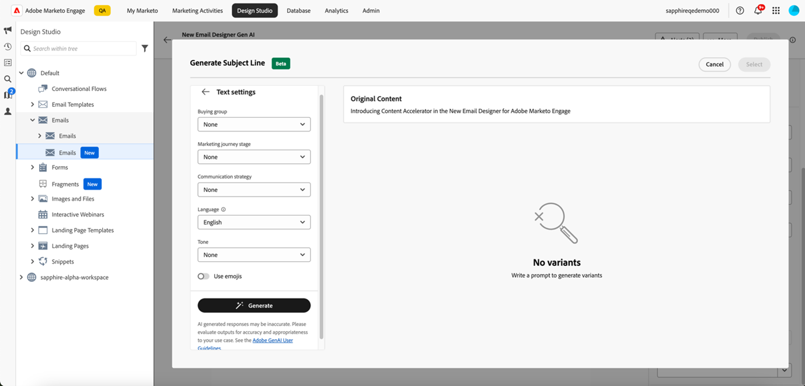

# 使用AI助手 {#use-the-ai-assistant}

Marketo Engage Email Designer中的AI助手可帮助您创建即时、高性能、直观的电子邮件。 这是通过Adobe的创作AI技术和提示库以及图像生成Firefly来实现的，该图像生成可帮助为特定角色/购买群体、营销历程阶段、沟通策略、语调等创建合适的内容。 还可以使用特定的品牌资产来创建内容。

>[!PREREQUISITES]
>
>默认情况下，未启用AI助手。 您必须首先同意核心Gen-AI条款和在Email Designer中使用Gen-AI功能的补充条款。 有关详细信息，请联系Adobe客户团队（您的客户经理）。

AI助手的主要用例有三个：

* [为您的电子邮件创建主题行](#create-a-subject-line)
* [为电子邮件的特定部分](#create-content-for-a-specific-section)创建内容
* [从选定模板创建整个电子邮件](#create-an-entire-email)

## 创建主题行 {#create-a-subject-line}

使用新建电子邮件Designer创建电子邮件时，输入临时主题行。

创建电子邮件后，主题行位于右侧的&#x200B;_详细信息_&#x200B;列中。 单击它旁边的AI助手按钮（）以获取有关使用Gen AI功能创建新主题行的帮助。

为AI助手启用&#x200B;**使用引用内容**&#x200B;选项，以根据所选内容对新内容进行个性化设置。

输入提示以自定义主题行。 输入相关文本设置并上传要用作引用的任何品牌资产，以创建相应的主题行。

文本设置包括：

<table><tbody>
  <tr>
    <td style="width:25%"><b>购买群组</b></td>
    <td>您定位的特定购买群体（例如，从业者、影响者、决策者）。</td>
  </tr>
  <tr>
    <td style="width:25%"><b>营销历程阶段</b></td>
    <td>特定营销历程阶段的收件人（例如，发现、评估、承诺）。</td>
  </tr>
  <tr>
    <td style="width:25%"><b>沟通策略</b></td>
    <td>通信的目标（例如，紧急、社会证明、信息性）。</td>
  </tr>
  <tr>
    <td style="width:25%"><b>语言</b></td>
    <td>您希望生成主题行的语言。</td>
  </tr>
  <tr>
    <td style="width:25%"><b>色调</b></td>
    <td>您希望生成内容的音调（例如，励志、兴奋、幽默）。</td>
  </tr>
  <tr>
    <td style="width:25%"><b>表情符号</b></td>
    <td>允许在生成的内容中包含表情符号。</td>
  </tr>
</tbody>
</table>

单击&#x200B;**生成**&#x200B;后，将显示示例供您选择：

您还可以上传品牌资产，以使用资产中的内容作为创建主题行的引用。

要选择变体，请选中其复选框，然后单击&#x200B;**选择**。 您还可以通过单击&#x200B;**优化**&#x200B;对其进行调整。 此外，您可以通过单击向上或向下缩略图图标提供反馈，以便Gen-AI技术学习您的偏好设置。

做出选择后，您的电子邮件详细信息中会填充主题行。

## 为电子邮件的特定部分创建内容 {#create-content-for-a-specific-section}

创建电子邮件后，您可以选择修改某些部分、图像或文本。

在此示例中，我们使用医疗保健模板。 如果医疗保健专家的现有形象无法满足您的需求，您可以指示AI助手创建自己的医疗保健专家形象。 只需选择图像内容，然后单击AI助手。

在提示符下输入相关详细信息，如“为医疗保健专家生成图像”，然后添加任何所需的自定义设置。 如果您不确定要输入什么，也可以使用提示库（位于提示的右侧）。

单击&#x200B;**生成**&#x200B;后，将创建多个变体供您选择。

与图像类似，也可以修改电子邮件的文本部分。

## 从所选模板创建整个电子邮件 {#create-an-entire-email}

仅当使用现有模板创建电子邮件时，此选项才可用。 它可以是Email Designer提供的标准模板、已创建的已保存模板或使用“导入HTML”选项导入的模板。 如果您为电子邮件选择[从头开始设计](/help/marketo/product-docs/email-marketing/email-designer/email-authoring.md#design-from-scratch)，则此选项不可用。

选择模板，而不选择模板中的任何组件，然后单击Email Designer中的AI助手按钮。

输入相关提示，然后选择文本设置、品牌资产以及您想要用于电子邮件的任何图像设置。

如果要使用Firefly生成图像，请选择“图像设置”，然后选择&#x200B;**使用AI生成图像**&#x200B;的切换开关。

选择所需的&#x200B;_内容类型_、_颜色和色调_、_光源_&#x200B;和&#x200B;_合成_，以便为您的电子邮件创建Gen-AI图像。 完成后单击&#x200B;**生成**。

通过单击&#x200B;**预览**，查看变体在电子邮件中的外观。 通过单击&#x200B;**应用**&#x200B;选择变量。
