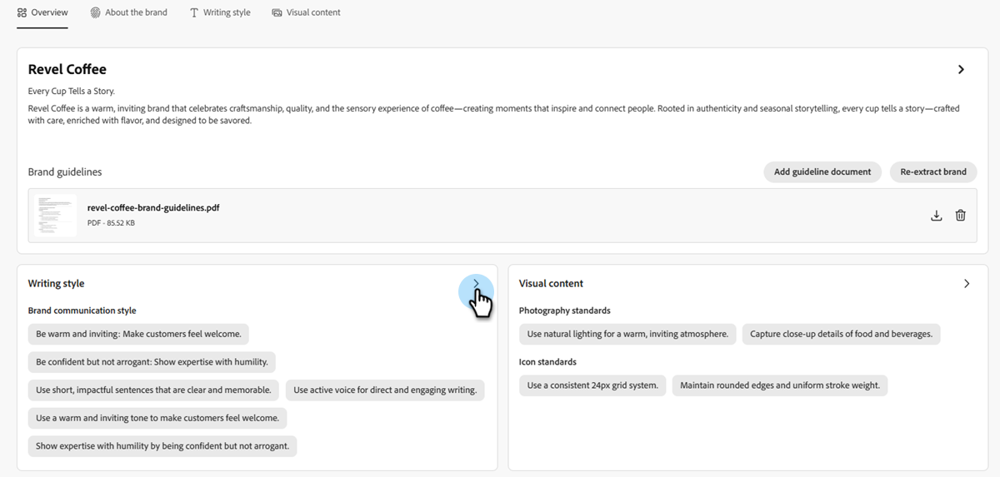

# 创建和管理您的品牌 {#create-and-manage-brands}

品牌指南是一组详细的规则和标准，用于建立品牌的视觉和语言标识。 它们用作参考，以在所有营销和通信平台上保持一致的品牌代表性。

手动输入并组织您的品牌详细信息或上传品牌准则文档以进行自动信息提取。

>[!AVAILABILITY]
>
>您必须同意[用户协议](https://www.adobe.com/cn/legal/licenses-terms/adobe-dx-gen-ai-user-guidelines.html){target="_blank"}，然后才能在Adobe Marketo Engage中使用AI助手。 有关更多信息，请与您的Adobe客户经理联系。

## 访问品牌 {#access}

若要访问&#x200B;**[!UICONTROL brands]**&#x200B;中的[!DNL Adobe Marketo Engage]菜单，需要向用户授予相关权限。

+++  了解如何分配品牌相关权限

### 用户和角色 {#users-and-roles}

1. 在&#x200B;_管理员_&#x200B;中，选择&#x200B;**用户和角色**。

1. 选择所需的角色。

1. 单击以展开&#x200B;**Access Design Studio**&#x200B;菜单。

1. 选择&#x200B;**访问AI助手**，然后单击&#x200B;**保存**。

+++

## 创建和管理您的品牌 {#create-brand-kit}

要创建和管理品牌指南，您可以自己输入详细信息，也可以上传品牌指南文档以自动提取信息。

1. 在&#x200B;_管理员_&#x200B;中，选择&#x200B;**新体验**。

   

1. 在&#x200B;_管理您的品牌_&#x200B;旁边，单击&#x200B;**编辑**。

   

1. 单击 **[!UICONTROL Create brand]**。

1. 为您的品牌输入&#x200B;**[!UICONTROL Name]**。

1. 拖放或选择PDF以上传品牌指南并自动提取相关的品牌信息。 单击 **[!UICONTROL Create]**。

   信息提取过程开始。 它可能需要几分钟才能完成。

   

1. 您的内容和可视化创建标准现在会自动填充。 浏览不同的选项卡以根据需要调整信息。

1. 从每个部分或类别的高级菜单中，您可以添加引用以自动提取相关品牌信息。

   要删除现有内容，请使用&#x200B;**[!UICONTROL Clear section]**&#x200B;或&#x200B;**[!UICONTROL Clear category]**&#x200B;选项。

   {width="800" zoomable="yes"}

   {width="800" zoomable="yes"}

1. 单击&#x200B;**筛选器**&#x200B;以按渠道或元素类型筛选准则。

   

1. 完成配置后，单击&#x200B;**[!UICONTROL Save]**，然后单击&#x200B;**[!UICONTROL Publish]**&#x200B;以使您的品牌准则可在AI助手中可用。

1. 要对已发布的品牌进行修改，请单击&#x200B;**[!UICONTROL Edit brand]**。

   >[!NOTE]
   >
   >这会在编辑模式下创建一个临时副本，在发布活动版本后替换活动版本。

   

1. 在&#x200B;**[!UICONTROL Brands]**&#x200B;仪表板中，单击三个圆点图标以打开高级菜单：

* 查看品牌
* Edit
* 重复
* 发布
* 取消发布
* 删除

  

现在，您可以从AI Assistant菜单的&#x200B;**[!UICONTROL Brand]**&#x200B;下拉菜单访问您的品牌指南，从而生成符合您规范的内容和资产。

### 设置默认品牌 {#default-brand}

您可以将已发布的品牌指定为默认值，以便在创建促销活动期间生成内容并计算对比分数时自动应用。

要设置默认品牌，请转到您的&#x200B;**[!UICONTROL Brands]**&#x200B;仪表板。 单击三个圆点图标并选择&#x200B;**[!UICONTROL Mark as default brand]**&#x200B;以打开高级菜单。

