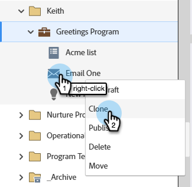

# CNIL指导合规性：条件电子邮件打开跟踪 {#cnil}

了解如何根据CNIL准则(COMMUNITY LINK)，配置Marketo Engage以遵循最终用户对电子邮件打开（像素）跟踪的同意。 该方法使用自定义布尔字段确定用户将收到的电子邮件变体，一个是启用了打开跟踪的变体，一个是禁用了打开跟踪的变体。

## 步骤1：创建自定义布尔字段 {#custom-field}

1. 在&#x200B;**管理员**&#x200B;区域中，单击&#x200B;**字段管理**&#x200B;并选择&#x200B;**新建自定义字段**。

   

1. 对于&#x200B;_对象_，请选择&#x200B;**人员**。 对于&#x200B;_类型_，请选择&#x200B;**布尔值**。 对于&#x200B;_名称_，输入“电子邮件像素跟踪”（API名称将自动填充）。 单击&#x200B;**创建**。

   

## 第2步：填充同意字段 {#populate}

1. 通过数据导入（API同步或[CSV上传](https://experienceleague.adobe.com/en/docs/marketo/using/getting-started/quick-wins/import-a-list-of-people){target="_blank"}）为每个人设置电子邮件像素跟踪字段值。

   

1. 确保正确映射自定义字段。

   

>[!NOTE]
>
>今后，您可以在表单填写期间直接捕获数据，从而允许人员选择加入或退出电子邮件打开跟踪。

## 步骤3：创建电子邮件变体 {#variants}

创建两封电子邮件。 请注意，默认情况下，电子邮件Designer和旧版电子邮件编辑器都启用电子邮件打开跟踪。

* **Email One （启用打开跟踪）**：创建电子邮件后，无需执行其他操作。 保持打开跟踪已启用。

* **电子邮件二（打开跟踪已禁用）**：克隆电子邮件一并禁用打开跟踪。

  

在电子邮件Designer中，可在电子邮件右侧&#x200B;_摘要_&#x200B;窗格的&#x200B;_详细信息_&#x200B;选项卡中找到&#x200B;**禁用打开跟踪**&#x200B;复选框。 在旧版电子邮件编辑器中，可以在&#x200B;_电子邮件设置_&#x200B;菜单中找到&#x200B;**禁用打开跟踪**&#x200B;复选框。

**电子邮件设计器**

{width="800" zoomable="yes"}

**旧版电子邮件编辑器**

{width="800" zoomable="yes"}

## 步骤4：配置Smart Campaign {#smart-campaign}

[创建Smart Campaign](https://experienceleague.adobe.com/en/docs/marketo/using/product-docs/core-marketo-concepts/smart-campaigns/creating-a-smart-campaign/create-a-new-smart-campaign){target="_blank"}以确定每个人收到的电子邮件。

1. 在Smart Campaign的&#x200B;_流程_&#x200B;选项卡中，插入&#x200B;**发送电子邮件**&#x200B;流程步骤。

   {width="800" zoomable="yes"}

1. 在流程步骤中，单击&#x200B;**添加选项**。 在Choice 1中，将&#x200B;**if**&#x200B;设置为&#x200B;_电子邮件像素跟踪_，将运算符设置为&#x200B;_is_，并将值设置为&#x200B;_false_。 对于&#x200B;**电子邮件**，请选择&#x200B;_电子邮件二_。

1. 在默认选择中，将&#x200B;**电子邮件**&#x200B;设置为&#x200B;_电子邮件One_。

   

这样可确保未同意打开跟踪的用户收到未跟踪电子邮件，而同意打开跟踪的用户收到标准跟踪电子邮件。
