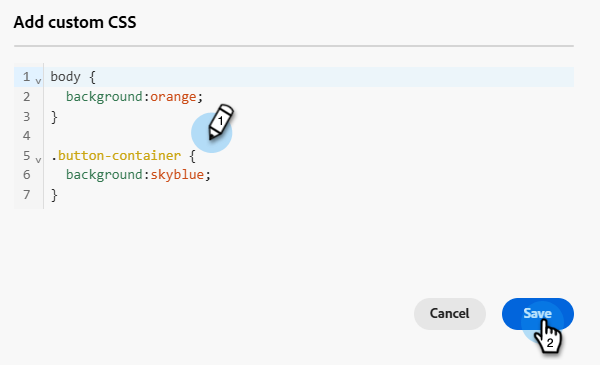
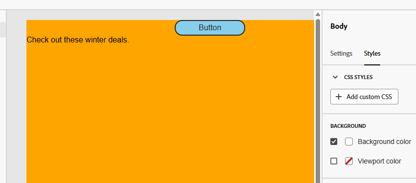

# 为电子邮件内容添加自定义 CSS {#custom-css}

直接在Marketo Engage Email Designer中添加您自己的自定义CSS，以进行高级特定样式。

## 定义自定义CSS {#define-custom-css}

1. 通过添加至少一个组件，确保在Email Designer中定义了一些内容。

1. 从左侧的&#x200B;**[!UICONTROL Body]**&#x200B;或右侧窗格中选择&#x200B;**[!UICONTROL Navigation tree]**。 **[!UICONTROL CSS styles]**&#x200B;显示在右侧。

   {width="800" zoomable="yes"}

   >[!NOTE]
   >
   >**[!UICONTROL CSS styles]**&#x200B;部分仅在编辑器中存在内容时可用。

1. 单击&#x200B;**[!UICONTROL + Add custom CSS]**&#x200B;按钮。

   >[!NOTE]
   >
   >**[!UICONTROL Add custom CSS]**&#x200B;按钮仅在选择&#x200B;**[!UICONTROL Body]**&#x200B;时可用。 但是，您可以将自定义CSS样式应用于内容中的所有组件。

1. 在弹出的专用文本区域中输入CSS代码。 确保自定义CSS [有效并且遵循正确的语法](#use-valid-css)。 完成后单击&#x200B;**保存**。

   

   >[!NOTE]
   >
   >使用包含锁定内容[的](/help/marketo/product-docs/email-marketing/email-designer/content-locking.md)模板时，无法向内容添加自定义CSS。 按钮标签更改为&#x200B;**[!UICONTROL View custom CSS]**，并且显示的所有自定义CSS均为只读。

1. 确保CSS适用于您的内容。 如果不适用，请查看[疑难解答](#troubleshooting)部分。

   

   >[!NOTE]
   >
   >如果删除所有内容，则该部分将消失，并且之前定义的自定义CSS将不再应用。 添加回内容以使&#x200B;**[!UICONTROL CSS styles]**&#x200B;部分重新显示。 再次应用自定义CSS。

## 使用有效的CSS {#using-valid-css}

您可以在&#x200B;**[!UICONTROL Add custom CSS]**&#x200B;文本区域中输入任何有效的CSS字符串。 格式正确的CSS会立即应用于内容。

>[!CAUTION]
>
>您对自定义CSS的安全负责。 确保CSS不会引入漏洞或与现有内容冲突。
>
>避免使用可能无意中破坏内容布局或功能的CSS。

+++ 有效CSS的示例

以下是有效CSS的示例。

```css
.acr-component[data-component-id="form"] {
  display: flex;
  justify-content: center;
  background: none;
}

.acr-Form {
  width: 100%;
  padding: 20px 100px;
  border-spacing: 0px 8px;
  box-sizing: border-box;
  margin: 0;
}

.acr-Form .spectrum-FieldLabel {
  width: 20%;
}

.acr-Form.spectrum-Form--labelsAbove .spectrum-FieldLabel,
.acr-Form [data-form-item="checkbox"] .spectrum-FieldLabel {
  width: auto;
}

.acr-Form .spectrum-Textfield {
  width: 100%;
}

#acr-form-error,
#acr-form-confirmation {
  width: 100%;
  padding: var(--spectrum-global-dimension-static-size-500);
  display: flex;
  align-items: center;
  flex-direction: column;
  justify-content: center;
  gap: var(--spectrum-global-dimension-static-size-200);
}

.spectrum-Form-item.is-required .spectrum-FieldLabel:after{
  content: '*';
  font-size: 1.25rem;
  margin-left: 5px;
  position: absolute;
}

/* Error field placeholder */
.spectrum-HelpText {
  display: none !important;
}

.spectrum-HelpText.is-invalid,
.is-invalid ~ .spectrum-HelpText {
  display: flex !important;
}
```

```css
@media only screen and (min-width: 600px) {
  .acr-paragraph-1 {
    width: 100% !important;
  }
}
```

+++


+++ 无效CSS的示例

如果输入的CSS无效，则会显示错误消息，指示CSS无法保存。 以下是无效CSS的示例。

不接受使用`<style>`标记：

```html
<style type="text/css">
  .acr-Form {
    width: 100%;
    padding: 20px 100px;
    border-spacing: 0px 8px;
    box-sizing: border-box;
    margin: 0;
  }
</style>
```

不接受无效语法，例如缺少大括号：

```css
body {
  background: red;
```

+++

## 技术实施 {#implementation}

您的自定义CSS已添加至`<head>`部分的末尾，作为具有`<style>`属性的`data-name="global-custom"`标记的一部分，如下面的示例所示。 这可确保将自定义样式全局应用于内容。

+++ 请参阅示例

```html
<!DOCTYPE html>
<html>
  <head>
    <meta charset="utf-8">
    <meta name="content-version" content="3.3.31">
    <meta name="x-apple-disable-message-reformatting">
    <meta name="viewport" content="width=device-width,initial-scale=1.0">
    <style data-name="default" type="text/css">
      td { padding: 0; }
      th { font-weight: normal; }
    </style>
    <style data-name="grid" type="text/css">
      .acr-grid-table { width: 100%; }
    </style>
    <style data-name="acr-theme" type="text/css" data-theme="default" data-variant="0">
      body { margin: 0; font-family: Arial; }
    </style>
    <style data-name="media-default-max-width-500px" type="text/css">
      @media screen and (max-width: 500px) {
        body { width: 100% !important; }
      }
    </style>
    <style data-name="global-custom" type="text/css">
      /* Add you custom CSS here */
    </style>
  </head>
  <body>
    <!-- Minimal content -->
  </body>
</html>
```

+++


电子邮件Designer的&#x200B;**[!UICONTROL Settings]**&#x200B;窗格不会解释或验证自定义CSS。 它是完全独立的，只能通过&#x200B;**[!UICONTROL Add Custom CSS]**&#x200B;选项进行修改。

### 护栏 — 导入的内容 {#guardrails}

如果要对导入到Email Designer中的内容使用自定义CSS，请考虑以下事项：

* 如果[正在导入包括CSS的外部HTML](/help/marketo/product-docs/email-marketing/email-designer/email-authoring.md#import-html)内容，除非您转换该内容，否则它将在&#x200B;**[!UICONTROL Compatibility mode]**&#x200B;中，其中&#x200B;**[!UICONTROL CSS styles]**&#x200B;部分不可用。

* 如果导入使用电子邮件Designer创建的内容时包含通过&#x200B;**[!UICONTROL Add custom CSS]**&#x200B;选项应用的CSS，则之前应用的CSS将可通过同一选项显示和编辑。

## 故障排除 {#troubleshooting}

如果未应用您的自定义CSS，请尝试以下建议。

* 确保CSS有效并且没有语法错误（例如缺少大括号、属性名称不正确）。 [了解如何操作](#use-valid-css)

* 确保将您的CSS添加到具有`<style>`属性的`data-name="global-custom"`标记中。

* 检查`global-custom`样式标记是否将属性`data-disabled`设置为`true`。 如果存在，则不会应用自定义CSS。

+++ 例如：

  ```html
  <style data-name="global-custom" type="text/css" data-disabled="true"> body: { color: red; } </style>
  ```

+++

* 确保您的CSS不会被其他CSS规则覆盖。

   * 使用浏览器开发人员工具检查内容，并验证CSS是否指向正确的选择器。

   * 考虑将`!important`添加到声明以确保它们优先。

+++ 例如：

     ```css
     .acr-Form {
       background: red !important;
     }
     ```

+++

>[!NOTE]
>
>未设置Marketo Engage支持以帮助对自定义CSS进行故障诊断。 有关CSS的帮助，请咨询Web开发人员。
