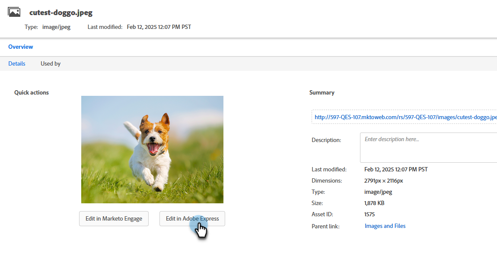

# 使用 Adobe Express 编辑图像 {#edit-images-with-adobe-express}

Adobe Marketo Engage与Adobe Express原生集成，可让您访问各种图像编辑工具。 您可以使用这些工具在Marketo Engage Design Studio中修改图像。 该集成具有以下主要优势：

* 通过在Marketo Engage中编辑和保存新图像来提高内容重复使用率。

* 减少了更新图像或创建现有图像的新版本的时间和精力。

>[!NOTE]
>
>Adobe Express目前仅支持PNG和JPEG图像文件格式。

## 访问Adobe Express编辑器 {#access-the-adobe-express-editor}

可通过两种方式访问Adobe Express编辑器：

* 单击图像名称
* _图像和文件操作_&#x200B;下拉菜单

>[!BEGINTABS]

>[!TAB 单击图像名称]

1. 在Marketo Engage中，转到&#x200B;**[!UICONTROL 设计工作室]**&#x200B;并选择&#x200B;**[!UICONTROL 图像和文件]**。

   {width="600" zoomable="yes"}

1. 选择要编辑的图像。

   {width="600" zoomable="yes"}

   >[!NOTE]
   >
   >* 要按工作区和文件夹查看资源，请单击左上角的&#x200B;**[!UICONTROL 显示文件夹]**&#x200B;图标以打开结构。
   >
   >* 要按任意列对表进行排序，请单击列标题。 标题行中的箭头指示当前排序列和顺序。

1. 在图像&#x200B;_详细信息_&#x200B;选项卡中，单击&#x200B;**[!UICONTROL 在Adobe Express中编辑]**。

   {width="600" zoomable="yes"}

   >[!CAUTION]
   >
   >如果图像已在电子邮件或电子邮件模板中被引用，则所做的任何编辑都会更新当前使用该图像的任意位置。

>[!TAB 映像和文件操作]

1. 在Marketo Engage中，转到&#x200B;**[!UICONTROL 设计工作室]**&#x200B;并选择&#x200B;**[!UICONTROL 图像和文件]**。

   {width="600" zoomable="yes"}

   >[!NOTE]
   >
   >* 要按工作区和文件夹查看资源，请单击左上角的&#x200B;**[!UICONTROL 显示文件夹]**&#x200B;图标以打开结构。
   >
   >* 要按任意列对表进行排序，请单击列标题。 标题行中的箭头指示当前排序列和顺序。

1. 选中要编辑的图像旁边的复选框。 在&#x200B;**[!UICONTROL 图像和文件操作]**&#x200B;下拉列表中，选择&#x200B;**[!UICONTROL 在Adobe Express中编辑]**。

   {width="600" zoomable="yes"}

   >[!CAUTION]
   >
   >如果图像已在电子邮件或电子邮件模板中被引用，则所做的任何编辑都会更新当前使用该图像的任意位置。

>[!ENDTABS]

## Adobe Express企业许可证 {#adobe-express-enterprise-license}

### 拥有企业许可证的用户 {#users-with-an-enterprise-license}

如果您拥有Adobe Express的企业版许可证，则有权访问完整的Express编辑器。 您可以调整图像设置，如颜色、亮度、锐度、对比度、大小等。 “AI魔术”选项允许您删除背景、插入和移除对象以及拭除图像的部分。 访问[Adobe Express用户指南](https://helpx.adobe.com/express/user-guide.html){target="_blank"}以了解每个设置。

>[!IMPORTANT]
>
>购买的许可证必须与您的Marketo Engage订阅属于同一个IMS组织，才能访问所有Adobe Express编辑功能。 此外，每个用户都必须在Adobe Express中拥有许可证。 没有许可证的用户[只能访问Adobe Express中的快速操作。](#users-without-an-enterprise-license)

### 没有企业许可证的用户 {#users-without-an-enterprise-license}

对于没有Enterprise许可证的用户，您仍然可以访问多个快速操作编辑功能。 这些功能包括：

* [调整图像大小](#resize-image)
* [删除背景](#remove-background)
* [裁切图像](#crop-image)
* [转换为PNG/JPEG](#convert-to-png-jpeg)

可在图像页面的左侧访问这些功能。

{width="800" zoomable="yes"}

#### 调整图像大小 {#resize-image}

1. 单击&#x200B;**调整图像大小**。

1. 进行所需的更改，完成后单击&#x200B;**应用**。

{width="800" zoomable="yes"}

<table><tbody>
  <tr>
    <td style="width:25%"><b>宽高比</b></td>
    <td>在<b>宽高比</b>下拉列表中，选择<b>标准</b>以从预先计算的常用照片大小中进行选择，或选择<b>自定义</b>以设置您自己的宽度/高度。 您还可以选择特定社交媒体平台的标准大小(Pinterest、Snapchat等)。</td>
  </tr>
  <tr>
    <td style="width:25%"><b>宽度和高度</b></td>
    <td>默认情况下，将锁定长宽比，这样在调整图像大小时，图像比例将保持不变。 如果需要，可以选择锁定按钮以解锁纵横比。</td>
  </tr>
  <tr>
    <td style="width:25%"><b>重置</b></td>
    <td>单击<b>重置</b>可删除对图像所做的任何编辑并将其恢复为原始状态。</td>
  </tr>
  <tr>
    <td style="width:25%"><b>缩放和裁切</b></td>
    <td>单击<b>缩放和裁切</b>可放大图像的特定区域。 缩放后单击<b>应用</b>可将图像裁剪为当前显示的内容。</td>
  </tr>
</tbody>
</table>

#### 删除背景 {#remove-background}

1. 单击&#x200B;**删除背景**。

1. Adobe Express显示没有背景的图像。 如果它符合您的需要，请单击&#x200B;**应用**。

{width="800" zoomable="yes"}

>[!TIP]
>
>如果对结果不满意，只需单击&#x200B;**X**&#x200B;关闭窗口即可。

#### 裁切图像 {#crop-image}

1. 单击&#x200B;**[!UICONTROL 裁切图像]**。

1. 拖动图像的角以创建所需的裁切。

{width="800" zoomable="yes"}

1. 完成后单击&#x200B;**[!UICONTROL 应用]**。

#### 转换为PNG/JPEG {#convert-to-png-jpeg}

将PNG文件转换为JPEG文件，或将JPEG文件转换为PNG文件。

1. 单击&#x200B;**[!UICONTROL 转换为PNG/JPEG]**。

{width="800" zoomable="yes"}

1. 单击&#x200B;**[!UICONTROL 应用]**。

## 保存您所做的工作 {#save-your-work}

完成所有编辑后，单击&#x200B;**保存**&#x200B;以保存您所做的工作。

{width="800" zoomable="yes"}

编辑后的图像将保存在与原始图像相同的文件夹中。
