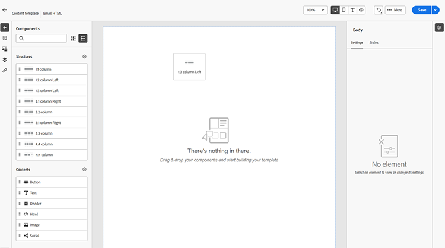

# 电子邮件创作 {#email-authoring}

了解如何在新的Marketo Engage Email Designer中创建、个性化和预览电子邮件。

>[!PREREQUISITES]
>
>要访问新的电子邮件设计器，必须将您的Marketo Engage订阅迁移到[Adobe Identity Management System (IMS)](https://experienceleague.adobe.com/en/docs/marketo/using/product-docs/administration/marketo-with-adobe-identity/adobe-identity-management-overview)。 如果尚未收到请求并想请求加急，请联系Adobe客户团队（您的客户经理）或[Marketo支持](https://nation.marketo.com/t5/support/ct-p/Support)。

## 创建电子邮件 {#create-an-email}

来自电子邮件设计器的电子邮件目前只能在Design Studio中创建并在智能营销活动/列表中引用，或直接在电子邮件程序中创建/使用。

>[!BEGINTABS]

>[!TAB 设计工作室]

1. 通过[Adobe Experience Cloud](https://experiencecloud.adobe.com/){target="_blank"}登录Marketo Engage。

1. 在“我的Marketo”中，选择&#x200B;**设计工作室**。

   

1. 在树中选择&#x200B;**电子邮件（新编辑器）**。

   

1. 单击&#x200B;**创建电子邮件**&#x200B;按钮。

   

1. 输入电子邮件名称和主题行。 单击&#x200B;**创建**。

   

>[!TAB 电子邮件程序]

1. 通过[Adobe Experience Cloud](https://experiencecloud.adobe.com/){target="_blank"}登录Marketo Engage。

1. 查找并选择（或创建）您的电子邮件程序。

   

1. 要创建新电子邮件，您有两个选项。 右键单击您的电子邮件计划名称并选择&#x200B;**新建本地资产**，或者单击仪表板“电子邮件”框中的&#x200B;**+新建电子邮件**&#x200B;按钮。 在本例中，我们将执行前者。

   

1. 选择&#x200B;**电子邮件（新编辑器）**。

   

1. 输入电子邮件名称和主题行。 单击&#x200B;**创建**。

   

>[!ENDTABS]

就是这样。 现在该设计您的电子邮件了。

## 选择您的内容类型 {#choose-your-content-type}

1. 在刚刚创建的电子邮件中，单击&#x200B;**添加电子邮件内容**。

   

1. 加载&#x200B;_创建电子邮件_&#x200B;页面。 您可以从以下几个选项中进行选择：

* [使用可视电子邮件编辑器从头开始设计](#design-from-scratch)

* [通过HTML或zip文件导入您自己的HTML](#import-html)

* [选择现有模板](#choose-a-template)（我们的一个示例或您已保存的示例）

### 从头开始设计 {#design-from-scratch}

在电子邮件编辑器中从头开始时，请使用以下选项来定义您的内容。

1. 在&#x200B;_创建电子邮件_&#x200B;页面中，选择&#x200B;**从头开始设计**。

1. 将[结构和内容](#add-structure-and-content)添加到您的电子邮件中。

1. 添加[图像](#add-assets)。

1. [个性化](#personalize-content)您的内容。

1. 查看链接并[编辑跟踪](#edit-url-tracking)。

### 导入HTML {#import-html}

您可以导入现有HTML内容来设计电子邮件。 内容可以是：

* 包含合并样式表的HTML文件

* 包含HTML文件、样式表(.css)和图像的.zip文件

>[!NOTE]
>
>.zip文件结构没有限制。 但是，引用必须是相对的，并且适合.zip文件夹的树结构。

1. 在“设计模板”页面中，选择&#x200B;**导入HTML**。

1. 拖放所需的HTML或.zip文件（或从您的计算机中选择一个文件），然后单击&#x200B;**导入**。

   

>[!NOTE]
>
>上传HTML内容后，您的内容将处于兼容模式。 在此模式下，您只能个性化文本、添加链接或向内容添加资产。

您可以使用[可视电子邮件编辑器工具](#add-structure-and-content)对导入的内容进行所需的更改。

### 选择模板 {#choose-a-template}

有两种类型的模板可供选择。

* **示例模板**： Marketo Engage提供了四个现成的电子邮件模板。

* **保存的模板**：这些模板是您使用“模板”菜单从头创建的模板，或者您创建并选择另存为模板的电子邮件。

>[!BEGINTABS]

>[!TAB 示例模板]

选择其中一个现成的模板，以抢先一步进行电子邮件模板设计。

1. 默认情况下，“示例模板”选项卡处于打开状态。

1. 选择要使用的模板。

   

1. 单击&#x200B;**使用此模板**。

   

1. 使用可视内容设计器根据需要编辑内容。

>[!TAB 已保存模板]

1. 单击&#x200B;**保存的模板**&#x200B;选项卡，然后选择所需的模板。

   

1. 单击&#x200B;**使用此模板**。

   

1. 使用可视内容设计器根据需要编辑内容。

>[!ENDTABS]

## 添加结构和内容 {#add-structure-and-content}

1. 要开始创建或修改内容，请将项目从“结构”拖放到画布上。 在右侧的窗格中编辑其设置。

   >[!TIP]
   >
   >选择n：n列组件以定义所选列数（3到10之间）。 您还可以通过移动列下方的箭头来定义每列的宽度。

   

   >[!NOTE]
   >
   >每个列大小不能小于结构组件总宽度的10%。 只能删除空列。

1. 从内容部分中，将所需项目拖放到一个或多个结构组件中。

   

1. 可通过“设置”或“样式”选项卡自定义每个组件。 更改字体、文本样式、边距等。

### 添加片段 {#add-fragments}

1. 要访问您的片段，请在左侧导航中选择&#x200B;_片段_&#x200B;图标（）。

   {width="700" zoomable="yes"}

1. 将任意片段拖放到结构组件的占位符中。

编辑器在电子邮件结构的部分/元素中呈现片段。 片段的内容在结构中动态更新，以显示内容在电子邮件中的显示方式。

>[!TIP]
>
>如果希望片段占据电子邮件中的整个水平布局，请添加1:1列结构，然后将片段拖放到其中。

保存电子邮件后，该电子邮件会显示在片段详细信息页面的&#x200B;_[!UICONTROL Used By]_选项卡中。 添加到电子邮件模板的片段在模板中不可编辑；源片段定义内容。

### 添加Assets {#add-assets}

添加存储在Marketo Engage实例的[图像和文件](/help/marketo/product-docs/demand-generation/images-and-files/add-images-and-files-to-marketo.md){target="_blank"}部分中的图像。

>[!NOTE]
>
>您现在只能在新设计器中添加图像，不能添加其他文件类型。

1. 要访问您的图像，请单击资产选择器图标。

   

1. 将所需的图像拖放到结构组件中。

   

   >[!NOTE]
   >
   >要替换现有图像，请选择该图像，然后在右侧的“设置”选项卡中单击&#x200B;**选择资产**。

### 图层、设置和样式 {#layers-settings-styles}

打开导航树以访问特定结构及其列/组件以进行更细粒度的编辑。 要访问，请单击导航树图标。

下面的示例概述了在由列组成的结构组件内调整填充和垂直对齐的步骤。

1. 直接在画布中选择结构组件中的列，或使用左侧显示的&#x200B;_导航树_。

1. 从列工具栏中，单击&#x200B;_[!UICONTROL Select a column]_工具并选择要编辑的工具。

   也可以从结构树中选择它。 该列的可编辑参数显示在右侧的&#x200B;_[!UICONTROL Settings]_和_[!UICONTROL Styles]_&#x200B;选项卡中。

   

1. 要编辑列属性，请单击右侧的&#x200B;_[!UICONTROL Styles]_选项卡，然后根据需要进行更改：

   * 对于&#x200B;**[!UICONTROL Background]**，根据需要更改背景颜色。

     清除透明背景的复选框。 启用&#x200B;**[!UICONTROL Background image]**&#x200B;设置以使用图像作为背景而不是纯色。

   * 对于&#x200B;**[!UICONTROL Alignment]**，选择&#x200B;_Top_、_Middle_&#x200B;或&#x200B;_Bottom_&#x200B;图标。
   * 对于&#x200B;**[!UICONTROL Padding]**，定义所有边的填充。

     如果要调整填充，请选择&#x200B;**[!UICONTROL Different padding for each side]**。 单击&#x200B;_锁定_&#x200B;图标中断同步。

   * 展开&#x200B;**[!UICONTROL Advanced]**&#x200B;部分以定义列的内联样式。

   

1. 根据需要重复这些步骤以调整组件中其他列的对齐和填充。

1. 保存更改。

### 个性化内容 {#personalize-content}

令牌在新编辑器中的工作方式与在旧编辑器中的工作方式相同，但图标的外观不同。 以下示例概述了如何使用回退文本添加名字令牌。

1. 选择文本组件。 将光标放在您希望令牌出现的位置，然后单击&#x200B;**添加个性化**&#x200B;图标。

   

1. 单击所需的[令牌类型](/help/marketo/product-docs/demand-generation/landing-pages/personalizing-landing-pages/tokens-overview.md){target="_blank"}。

   

1. 找到所需的令牌，然后单击&#x200B;**...**&#x200B;图标（改为单击+图标可添加不含回退文本的令牌）。

   

   >[!NOTE]
   >
   >“回退文本”是适用于默认值的新编辑器术语。 示例： ``{{lead.First Name:default=Friend}}``。 如果所选字段中没有人员的值，则建议使用此字段。

1. 设置您的回退文本，然后单击&#x200B;**添加**。

   

1. 单击&#x200B;**保存**。

### 编辑URL跟踪 {#edit-url-tracking}

有时，您不希望通过电子邮件在链接上启用Marketo跟踪URL。 当目标页面不支持URL参数并且可能导致链接断开时，这将很有用。

1. 单击链接图标以显示电子邮件中的所有URL。

   

1. 单击铅笔图标可编辑任何所需链接的跟踪。

1. 单击&#x200B;**跟踪类型**&#x200B;下拉列表并进行选择。

   

   <table><tbody>
     <tr>
       <td><b>不使用mkt_tok跟踪</b></td>
       <td>激活对URL的跟踪，而无需在目标URL中使用mkt_tok查询字符串参数</td>
     </tr>
     <tr>
       <td><b>使用mkt_tok跟踪</b></td>
       <td>使用目标URL中的mkt_tok查询字符串参数激活对URL的跟踪</td>
     </tr>
     <tr>
       <td><b>不跟踪</b></td>
       <td>禁用URL跟踪</td>
     </tr>
   </tbody>
   </table>

1. 或者，您可以为URL设置标签或添加标记。

1. 完成后单击&#x200B;**保存**。

## 检查警报 {#check-alerts}

设计内容时，如果缺少关键设置，屏幕右上角会显示警报。

警报有两种类型：

**个警告**

警告指代建议和最佳实践，例如：

* **电子邮件正文中不存在选择退出链接**：虽然取消订阅链接是必需的，但最佳做法是将它们添加到电子邮件正文中。

>[!NOTE]
>
>[操作电子邮件](/help/marketo/product-docs/email-marketing/general/functions-in-the-editor/make-an-email-operational.md)（非营销）不需要添加取消订阅选项。

* **HTML的文本版本为空**：您必须为无法显示HTML内容时定义电子邮件正文的文本版本。

* **电子邮件正文中存在空链接**：验证电子邮件中的所有链接是否正确。

* **电子邮件大小已超出100KB的限制**：若要获得最佳投放，请确保电子邮件大小不超过100KB。

**个错误**

在解决错误之前，您无法发送或测试电子邮件：

* **主题行缺失**：需要电子邮件主题行。

* **邮件的电子邮件版本为空**：当尚未配置电子邮件内容时，会发生此错误。

## 测试电子邮件 {#test-your-email}

定义消息内容后，您可以使用测试用户档案对其进行预览、发送校样并控制它在常用桌面、移动和基于Web的客户端中的呈现方式。 如果插入个性化内容，则可以使用测试用户档案数据检查该内容在消息中的显示方式。

要预览电子邮件内容，请单击&#x200B;**模拟内容**，然后添加测试用户档案，以使用测试用户档案数据检查邮件。

## 引用电子邮件 {#reference-an-email}

电子邮件Designer电子邮件可通过电子邮件、参与、默认和事件程序（交互式网络研讨会程序除外）访问。 如果您在Design Studio中创建了电子邮件，则可以从智能营销活动和/或智能列表中引用该电子邮件，就像使用任何其他电子邮件一样。

* 按照常规步骤](/help/marketo/product-docs/core-marketo-concepts/smart-lists-and-static-lists/creating-a-smart-list/create-a-smart-list.md)，[在智能列表中引用它。

* 按照常规步骤](/help/marketo/product-docs/core-marketo-concepts/smart-campaigns/creating-a-smart-campaign/create-a-new-smart-campaign.md)，[在Smart Campaign中引用它。

>[!NOTE]
>
>只能引用保存的电子邮件。 新电子邮件设计工具中没有“已批准”状态。

>[!MORELIKETHIS]
>
>[电子邮件模板](/help/marketo/product-docs/email-marketing/email-designer/email-template-authoring.md){target="_blank"}：了解如何在新的设计器中创建、设计和访问电子邮件模板。
