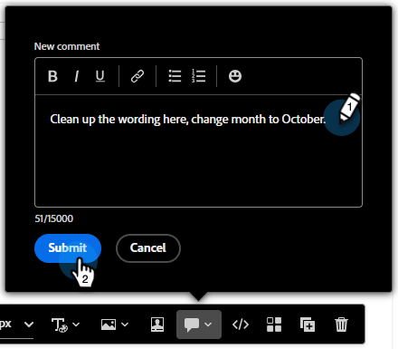

# 电子邮件协作 {#email-collaboration}

电子邮件协作和注释允许营销团队在Adobe Marketo Engage Email Designer中无缝地审核、讨论和最终确定电子邮件资产。 您可以实时评论、建议编辑和解决反馈，而不是通过外部工具（如聊天、电子邮件线程、电子表格等）共享草稿。 这可以简化工作流程，减少错误，并确保在发送电子邮件营销活动之前与利益相关者保持一致。

## 权限 {#permissions}

对电子邮件资源具有编辑权限的用户将能够评论、标记和查看评论。 对电子邮件资源具有只读权限的用户将&#x200B;**无法**&#x200B;添加或查看评论。

## 添加评论 {#add-comments}

1. 在Email Designer中创建或编辑电子邮件时，单击任何可编辑部分上的结构、列或内容（文本、图像、按钮等）。

   

1. 单击注释图标。

   

1. 输入反馈、问题或建议。

   

>[!NOTE]
>
>使用@mentions标记团队成员(例如，“@John，请更新冬季新闻稿”)。

## 查看所有评论 {#view-all-comments}

1. 单击右侧的&#x200B;_Collaboration_&#x200B;图标。

   

1. 快速回复或喜欢评论。

   

1. 单击&#x200B;**...**&#x200B;图标以了解更多操作。

   

## 解决评论 {#resolve-comments}

每个注释线程包括：

* 答复：继续讨论
* 解决：将评论标记为已解决
* 未解决：如果需要进一步编辑
* 移除：从设计元素中移除注释
* 删除：永久删除评论

>[!NOTE]
>
>解析的线程默认处于隐藏状态，但可通过在过滤器中选择所需的线程来重新访问。

## 通知 {#notifications}

被标记的团队成员会通过电子邮件和/或Pulse通知接收通知。

会触发以下项目的通知：

* 新注释
* 提及(@username)
* 分辨率

## 最佳实践 {#best-practices}

* 使用@mentions确保将反馈快速提供给合适的团队成员。

* 将相关反馈分组到单个注释线程中，而不是多个分散的注释中。

* 始终解决注释后才能保持工作流程干净。

* 保存最终批准的版本以供合规/审核之用。
