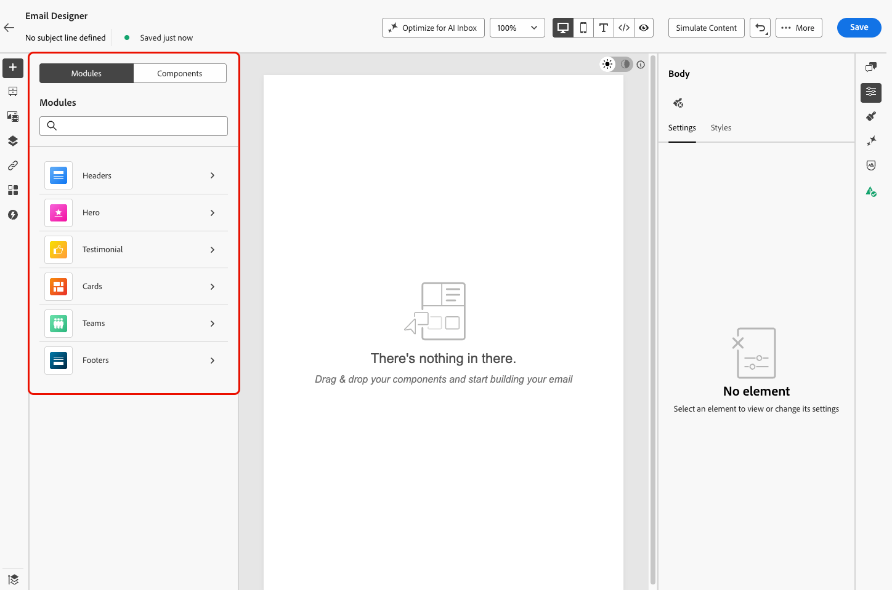

# 在电子邮件Designer中使用模块 {#email-modules}

Email Designer包括&#x200B;_个模块的库_：现成的完全结构化的内容块，旨在加快电子邮件汇编并提升通信中的设计一致性。

与从头开始配置的空占位符[内容组件](/help/marketo/product-docs/email-marketing/email-designer/email-authoring.md#add-structure-and-content)不同，模块是预建部分（如品牌标题、产品卡网格或带选择退出链接的页脚），您可以将这些部分直接拖放到画布上并从那里进行自定义。

>[!NOTE]
>
>模块不是片段。 它们存在于您设计的电子邮件中。 但是，根据您的需求自定义模块后，您可以将其另存为[可视化片段](/help/marketo/product-docs/email-marketing/email-designer/fragments.md#visual-fragments)，以在其他电子邮件和消息中重复使用。

## 访问和插入模块 {#access-modules}

要显示和利用电子邮件Designer中的可用模块，请执行以下步骤。

1. 打开所需的电子邮件。

1. 在左窗格中，单击&#x200B;**[!UICONTROL Modules]**&#x200B;选项卡。

   

1. 浏览可用的模块类别，或使用搜索栏按名称进行筛选。

1. 单击类别旁边的&#x200B;**>**&#x200B;箭头可展开该类别并查看可用的布局变体。

1. 找到要使用的模块变体，然后将其直接拖放到电子邮件画布上。

   

1. 插入模块时会显示其默认内容。 单击画布上的任何元素以开始编辑内联内容。 单击任意文本区域以直接键入，或单击图像以使用资产库替换图像。

   >[!NOTE]
   >
   >将电子邮件主题应用于内容时，模块会自动继承应用的主题样式，从而确保设计中的品牌一致性。

1. 使用右侧窗格中的&#x200B;**[!UICONTROL Settings]**&#x200B;和&#x200B;**[!UICONTROL Styles]**&#x200B;选项卡可调整属性和样式，就像您对任何其他电子邮件元素所做的那样。

   {width="70%"}

1. 您还可以将[内容组件](/help/marketo/product-docs/email-marketing/email-designer/email-authoring.md#add-structure-and-content)直接添加到模块。 切换到左窗格中的&#x200B;**[!UICONTROL Components]**&#x200B;选项卡，然后将组件拖放到模块中。 组件默认继承模块的样式，但您可以根据需要覆盖它。

   {width="60%"}

## 可用模块 {#available-modules}

以下模块类别现成可用。 每个模块都存在多个布局变量，例如，单列、两列和三列网格。 展开模块类别以选择适合您布局的变体。

| 模块 | 描述 |
|---|---|
| **[!UICONTROL Headers]** | 带有您徽标、导航链接和介绍性文本的品牌电子邮件标题。 |
| **[!UICONTROL Hero]** | 全宽横幅部分：非常适用于促销活动、公告或促销活动打开者。 |
| **[!UICONTROL Testimonial]** | 以一致的样式格式引用客户引号或社交证明。 |
| **[!UICONTROL Cards]** | 单列或多列网格布局中的产品、文章或内容项。 |
| **[!UICONTROL Teams]** | 团队成员、作者或拥有照片、姓名和角色的发言人。 |
| **[!UICONTROL Footers]** | 完整的电子邮件页脚，包含导航链接、社交媒体图标、法律副本，以及所需的选择退出和镜像页面链接。 |
