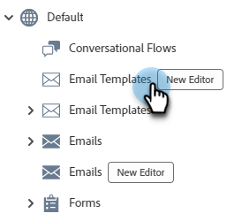
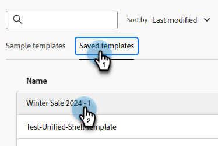

# 电子邮件模板创作 {#email-template-authoring}

为了加快并改进设计过程，您可以创建独立的电子邮件模板以轻松重用自定义内容。

>[!PREREQUISITES]
>
>要访问新的电子邮件设计器，必须将您的Marketo Engage订阅迁移到[Adobe Identity Management System (IMS)](https://experienceleague.adobe.com/en/docs/marketo/using/product-docs/administration/marketo-with-adobe-identity/adobe-identity-management-overview)。 如果尚未收到请求并想请求加急，请联系Adobe客户团队（您的客户经理）或[Marketo支持](https://nation.marketo.com/t5/support/ct-p/Support)。

>[!NOTE]
>
>新电子邮件设计器中的电子邮件模板只能用于新电子邮件设计器中的创建电子邮件。 在旧电子邮件编辑器中无法引用它们。

## 创建电子邮件模板 {#create-an-email-template}

1. 通过[Adobe Experience Cloud](https://experiencecloud.adobe.com/){target="_blank"}登录Marketo Engage。

1. 在“我的Marketo”中，选择&#x200B;**设计工作室**。

   

1. 在树中选择&#x200B;**电子邮件模板（新编辑器）**。

   

1. 单击&#x200B;**创建模板**&#x200B;按钮。

   

1. 输入模板名称和可选说明。 单击&#x200B;**创建**。

   

## 设计模板 {#design-your-template}

在&#x200B;_设计模板_&#x200B;页面中，可以从几个选项中进行选择。 [从头开始设计](#design-from-scratch)、[导入您自己的HTML](#import-html)或[选择现有模板](#choose-a-template)（我们的示例之一或您已保存的示例）。

### 从头开始设计 {#design-from-scratch}

通过简单的拖放操作添加和移动结构元素来定义内容。

1. 在&#x200B;_设计模板_&#x200B;页面中，选择&#x200B;**从头开始设计**。

1. 添加[结构和内容](#add-structure-and-content)。

### 导入您的HTML {#import-your-html}

您可以导入现有HTML内容以设计电子邮件模板。 内容可以是：

* 包含合并样式表的HTML文件

* 包含HTML文件、样式表(.css)和图像的.zip文件

>[!NOTE]
>
>.zip文件结构没有限制。 但是，引用必须是相对的，并且适合.zip文件夹的树结构。

1. 在&#x200B;_设计您的模板_&#x200B;页面中，选择&#x200B;**导入HTML**。

1. 拖放所需的HTML或.zip文件（或从您的计算机中选择一个文件），然后单击&#x200B;**导入**。

   

   >[!NOTE]
   >
   >上传HTML内容后，您的内容将处于兼容模式。 在此模式下，您只能个性化文本、添加链接或向内容添加资产。

1. 若要利用Email Designer内容组件，请单击&#x200B;**HTML converter**&#x200B;选项卡，然后单击&#x200B;**转换**。

   >[!CAUTION]
   >
   >在HTML文件中使用`<table>`标记作为第一层可能会导致样式丢失，包括顶层标记中的背景和宽度设置。

现在，您可以根据需要使用可视电子邮件编辑器对导入的文件进行个性化设置。

### 选择模板 {#choose-a-template}

有两种类型的模板可供选择。

* **示例模板**： Marketo Engage提供了四个现成的电子邮件模板。

* **保存的模板**：这些模板是您使用“模板”菜单从头创建的模板，或者您创建并选择另存为模板的电子邮件。

>[!BEGINTABS]

>[!TAB 示例模板]

选择其中一个现成的模板，以抢先一步进行电子邮件模板设计。

1. 默认情况下，“示例模板”选项卡处于打开状态。

1. 选择要使用的模板。

   

1. 单击&#x200B;**使用此模板**。

   

1. 使用可视内容设计器根据需要编辑内容。

>[!TAB 已保存模板]

1. 单击&#x200B;**保存的模板**&#x200B;选项卡，然后选择所需的模板。

   

1. 单击&#x200B;**使用此模板**。

   

1. 使用可视内容设计器根据需要编辑内容。

>[!ENDTABS]

## 添加结构和内容 {#add-structure-and-content}

1. 要开始创建或修改内容，请将项目从“结构”拖放到画布上。 在右侧的窗格中编辑其设置。

   >[!TIP]
   >
   >选择n：n列组件以定义所选列数（3到10之间）。 您还可以通过移动列下方的箭头来定义每列的宽度。

   

   >[!NOTE]
   >
   >每个列大小不能小于结构组件总宽度的10%。 只能删除空列。

1. 从内容部分中，将所需项目拖放到一个或多个结构组件中。

   

1. 可通过“设置”或“样式”选项卡自定义每个组件。 更改字体、文本样式、边距等。

### 添加片段 {#add-fragments}

1. 要访问您的片段，请在左侧导航中选择&#x200B;_片段_&#x200B;图标（）。

   {width="700" zoomable="yes"}

1. 将任意片段拖放到结构组件的占位符中。

编辑器在电子邮件结构的部分/元素中呈现片段。 片段的内容在结构中动态更新，以显示内容在电子邮件中的显示方式。

>[!TIP]
>
>如果希望片段占据电子邮件中的整个水平布局，请添加1:1列结构，然后将片段拖放到其中。

保存电子邮件后，该电子邮件会显示在片段详细信息页面的&#x200B;_[!UICONTROL Used By]_选项卡中。 添加到电子邮件模板的片段在模板中不可编辑；源片段定义内容。

### 添加资源 {#add-assets}

添加存储在Marketo Engage实例的[图像和文件](/help/marketo/product-docs/demand-generation/images-and-files/add-images-and-files-to-marketo.md){target="_blank"}部分中的图像。

>[!NOTE]
>
>您现在只能在新设计器中添加图像，不能添加其他文件类型。

1. 要访问您的图像，请单击资产选择器图标。

   

1. 将所需的图像拖放到结构组件中。

   

   >[!NOTE]
   >
   >要替换现有图像，请选择该图像，然后在右侧的“设置”选项卡中单击&#x200B;**选择资产**。

### 图层、设置和样式 {#layers-settings-styles}

打开导航树以访问特定结构及其列/组件以进行更细粒度的编辑。 要访问，请单击导航树图标。

下面的示例概述了在由列组成的结构组件内调整填充和垂直对齐的步骤。

1. 直接在画布中选择结构组件中的列，或使用左侧显示的&#x200B;_导航树_。

1. 从列工具栏中，单击&#x200B;_[!UICONTROL Select a column]_工具并选择要编辑的工具。

   也可以从结构树中选择它。 该列的可编辑参数显示在右侧的&#x200B;_[!UICONTROL Settings]_和_[!UICONTROL Styles]_&#x200B;选项卡中。

   

1. 要编辑列属性，请单击右侧的&#x200B;_[!UICONTROL Styles]_选项卡，然后根据需要进行更改：

   * 对于&#x200B;**[!UICONTROL Background]**，根据需要更改背景颜色。

     清除透明背景的复选框。 启用&#x200B;**[!UICONTROL Background image]**&#x200B;设置以使用图像作为背景而不是纯色。

   * 对于&#x200B;**[!UICONTROL Alignment]**，选择&#x200B;_Top_、_Middle_&#x200B;或&#x200B;_Bottom_&#x200B;图标。
   * 对于&#x200B;**[!UICONTROL Padding]**，定义所有边的填充。

     如果要调整填充，请选择&#x200B;**[!UICONTROL Different padding for each side]**。 单击&#x200B;_锁定_&#x200B;图标中断同步。

   * 展开&#x200B;**[!UICONTROL Advanced]**&#x200B;部分以定义列的内联样式。

   

1. 根据需要重复这些步骤以调整组件中其他列的对齐和填充。

1. 保存更改。

### 使内容个性化 {#personalize-content}

令牌在新编辑器中的工作方式与在旧编辑器中的工作方式相同，但图标的外观不同。 以下示例概述了如何使用回退文本添加名字令牌。

1. 选择文本组件。 将光标放在您希望令牌出现的位置，然后单击&#x200B;**添加个性化**&#x200B;图标。

   

1. 单击所需的[令牌类型](/help/marketo/product-docs/demand-generation/landing-pages/personalizing-landing-pages/tokens-overview.md){target="_blank"}。

   

1. 找到所需的令牌，然后单击&#x200B;**...**&#x200B;图标（改为单击+图标可添加不含回退文本的令牌）。

   

   >[!NOTE]
   >
   >“回退文本”是适用于默认值的新编辑器术语。 示例： ``{{lead.First Name:default=Friend}}``。 如果所选字段中没有人员的值，则建议使用此字段。

1. 设置您的回退文本，然后单击&#x200B;**添加**。

   

1. 单击&#x200B;**保存**。

### 编辑URL跟踪 {#edit-url-tracking}

有时，您不希望通过电子邮件在链接上启用Marketo跟踪URL。 当目标页面不支持URL参数并且可能导致链接断开时，这将很有用。

1. 单击链接图标以显示电子邮件中的所有URL。

   

1. 单击铅笔图标可编辑任何所需链接的跟踪。

1. 单击&#x200B;**跟踪类型**&#x200B;下拉列表并进行选择。

   

   <table><tbody>
     <tr>
       <td><b>不使用mkt_tok跟踪</b></td>
       <td>激活对URL的跟踪，而无需在目标URL中使用mkt_tok查询字符串参数</td>
     </tr>
     <tr>
       <td><b>使用mkt_tok跟踪</b></td>
       <td>使用目标URL中的mkt_tok查询字符串参数激活对URL的跟踪</td>
     </tr>
     <tr>
       <td><b>不跟踪</b></td>
       <td>禁用URL跟踪</td>
     </tr>
   </tbody>
   </table>

1. 或者，您可以为URL设置标签或添加标记。

1. 完成后单击&#x200B;**保存**。

### 查看选项 {#view-options}

利用可视电子邮件编辑器中提供的视图和内容验证选项。

* 使用预设的缩放选项放大/缩小内容。

* 在桌面、移动设备或纯文本/纯文本中查看内容。

   * 单击实时视图（眼睛）图标可跨设备预览内容。

   * 选择其中一个现成的设备或输入自定义维度以预览您的内容。

### 更多选项 {#more-options}

在内容编辑器的&#x200B;**更多**&#x200B;选项中，您可以执行以下操作：

* **重置模板**：选择此项可将可视电子邮件设计器画布清除为空白并重新启动内容生成。

* **更改您的设计**：返回到&#x200B;_设计您的模板_&#x200B;页面。 从此处，您可以按照[设计模板](#design-your-template)部分中概述的步骤执行任何操作。

* **导出HTML**：将可视画布中的内容以HTML格式下载到您的本地系统，并打包为zip文件。

## 查看模板详细信息 {#view-template-details}

在&#x200B;_电子邮件模板_&#x200B;列表页中，单击电子邮件模板名称以查看其详细信息。

可以编辑名称和描述等基本详细信息。 在编辑的字段外单击，以保存更改。

单击&#x200B;**更多**&#x200B;可快速删除或复制您的模板。

如果有任何活动警报（电子邮件模板的错误/警告），请单击警报以查看相关信息。

>[!NOTE]
>
>虽然这些警报不禁止使用电子邮件模板创建电子邮件，但信息可提供在电子邮件可用于投放之前可能不起作用的内容和所需更新的可见性。

## 查看引用使用的电子邮件模板 {#email-template-used-by-references}

在电子邮件模板摘要中，单击&#x200B;**使用者**&#x200B;选项卡以查看有关在Marketo Engage中使用此电子邮件模板位置的详细信息。

## 编辑电子邮件模板 {#edit-email-templates}

此操作可从以下位置执行：

* 详细信息选项卡 — 单击&#x200B;**编辑电子邮件模板**。

此操作会将您引导至&#x200B;_根据电子邮件模板的上次保存状态设计您的模板_&#x200B;页面或可视内容编辑器页面。 在此处，您可以根据需要编辑电子邮件模板内容。 有关编辑选项的信息，请参阅创建电子邮件模板。

## 重复的电子邮件模板 {#duplicate-email-templates}

复制电子邮件模板的方法有两种：

* 从右侧的电子邮件模板详细信息中，单击&#x200B;**更多**&#x200B;并选择&#x200B;**复制**。

  

* 在&#x200B;_电子邮件模板_&#x200B;列表页面中，单击所需电子邮件模板的“更多操作”图标（三个圆点），然后选择&#x200B;**复制**。

在对话框中，输入唯一名称和可选描述。 完成后单击&#x200B;**复制**。

然后，复制的电子邮件模板出现在&#x200B;_电子邮件模板_&#x200B;列表页中。

## 删除电子邮件模板 {#delete-email-templates}

可通过两种方式删除电子邮件模板。

>[!CAUTION]
>
>无法撤消删除电子邮件模板的操作。

* 从右侧的电子邮件模板详细信息中，单击&#x200B;**更多**&#x200B;并选择&#x200B;**删除**。

  

* 在&#x200B;_电子邮件模板_&#x200B;列表页面中，单击所需电子邮件模板的“更多操作”图标（三个圆点），然后选择&#x200B;**删除**。

## 批量操作 {#bulk-actions}

从&#x200B;_电子邮件模板_&#x200B;列表页面中，选中左侧的复选框以选择多个模板。 底部会显示一条横幅。

**删除**：一次最多可以删除20个模板。 确认对话框允许您中止操作或确认删除。

>[!MORELIKETHIS]
>
>[电子邮件创作](/help/marketo/product-docs/email-marketing/email-designer/email-authoring.md){target="_blank"}：了解如何在新的设计器中创建、设计和引用电子邮件。
