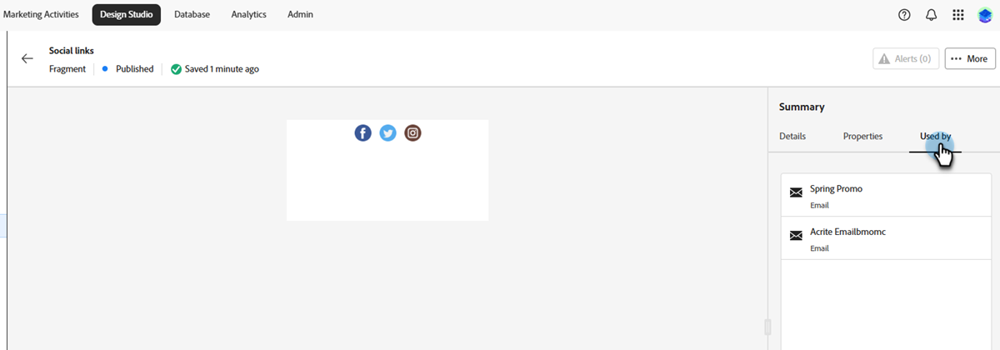
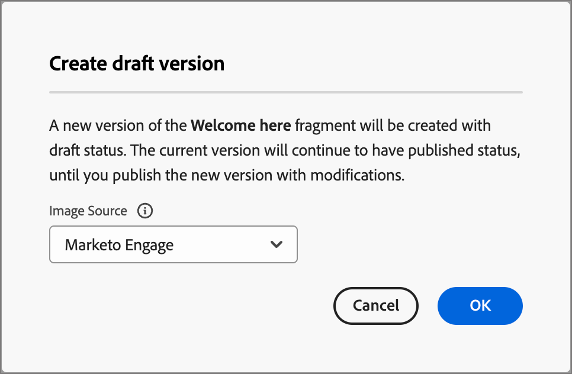

# 片段

片段是可重用组件，可在一个或多个电子邮件和电子邮件模板中引用。 它通常是可快速插入到项目中的内容块（文本、图像或两者）。 利用此功能，您可以预构建多个自定义内容块以组合电子邮件内容，从而改进设计过程。 常见用例包括电子邮件的页眉/页脚内容块、事件邀请横幅、季节性消息等。

>[!NOTE]
>
>片段相当于旧电子邮件编辑器中的[片段](/help/marketo/product-docs/personalization/segmentation-and-snippets/snippets/create-a-snippet.md){target="_blank"}。

要在工作流中充分利用片段，请执行以下操作：

* _创建片段_ — 从头开始创建可视化片段，或从可视化内容编辑器中将内容另存为片段。
* _重用片段_ — 根据需要多次在内容中使用它们。

## 可视化片段 {#visual-fragments}

可视化片段是预定义的可视化块，可使用可视内容编辑器构建，可在多个电子邮件或电子邮件模板中重复使用。

## 访问和管理片段 {#access-and-manage-fragments}

要访问可视化片段，请转到Marketo Engage中的&#x200B;**设计工作室**。 在左侧的树中，单击&#x200B;**[!UICONTROL Fragments (New)]**。

{width="600" zoomable="yes"}

默认情况下，该表按&#x200B;_[!UICONTROL Modified]_列排序。 单击其他列标题以更改表的排序依据。 再次单击同一标题可在升序和降序之间切换。

### 查找和筛选

使用搜索栏按名称查找片段。 单击&#x200B;_筛选器_&#x200B;图标（）以显示可用的筛选器选项并选择所需的设置。

{width="700" zoomable="yes"}

### 自定义列 {#customize-the-column-display}

通过单击右上角的&#x200B;_自定义表_&#x200B;图标（）自定义要在表中显示的列。

选择所需的列，然后单击&#x200B;**[!UICONTROL Apply]**。

{width="400" zoomable="yes"}

### 片段状态 {#fragment-status}

片段状态决定了在电子邮件或电子邮件模板中使用的可用性，以及您可以对其进行的更改。

<table>
<tbody>
  <tr>
    <td width="25%"><b>草稿</b></td>
    <td width="75%">创建片段时，它处于草稿状态。 在发布它以用于电子邮件或电子邮件模板之前，它仍为草稿。
    
可用操作：
    <li>编辑所有详细信息</li>
    <li>在可视设计器中编辑</li>
    <li>发布</li>
    <li>重复</li>
    <li>删除</li>
  </td>
  <tr>
    <td><b>发布日期</b></td>
    <td>发布片段后，该片段将可用于电子邮件或电子邮件模板。 在可视设计器中无法修改已发布的片段内容。
    
可用操作：
    <li>编辑描述</li>
    <li>添加到电子邮件或模板</li>
    <li>创建草稿版本</li>
    <li>重复</li>
    <li>删除（如果未使用）</li>
    </td>
  </tr>
  <tr>
    <td style="width:25%"><b>以草稿发布</b></td>
    <td style="width:75%">从已发布的片段创建草稿时，已发布的版本仍然可用于电子邮件或电子邮件模板，并且草稿内容可以在可视设计器中进行修改。 如果您发布草稿版本，它将替换当前已发布的版本，并且内容将在<i>所有</i>正在使用草稿的电子邮件和电子邮件模板中更新。
    
可用操作：
    <li>编辑描述</li>
    <li>添加到电子邮件或模板</li>
    <li>在可视设计器中编辑草稿版本</li>
    <li>发布草稿版本</li>
    <li>重复</li>
    <li>删除（如果未使用）</li>
    </td>
  </tr>
</tbody>
</table>

## 创建片段 {#create-a-fragment}

1. 要创建新的可视片段，请单击片段列表页面右上角的&#x200B;**[!UICONTROL Create fragment]**。

   {width="700" zoomable="yes"}

1. 为片段提供&#x200B;**[!UICONTROL Name]**&#x200B;和可选的&#x200B;**[!UICONTROL Description]**。

   _片段要求_

   * 名称：最多100个字符，必须是唯一的，不区分大小写
   * 描述：最多300个字符
   * 字符：可使用字母、数字和特殊字符
   * 保留字符为&#x200B;**_不允许_**： `\ / : * ? " < > |`

   {width="400" zoomable="yes"}

1. 单击 **[!UICONTROL Create]**。

   {width="400" zoomable="yes"}

   >[!NOTE]
   >
   >此时无法修改片段的&#x200B;**类型**。

1. 此时会显示&#x200B;_创建电子邮件_&#x200B;模式。 选择&#x200B;_使用主题_&#x200B;或&#x200B;_手动样式设置_。 在此选项中，我们选择&#x200B;**使用主题**。 完成后单击&#x200B;**确认**。

   

   >[!NOTE]
   >
   >如果选择“手动样式设置”，请使用[内容设计工具](/help/marketo/product-docs/email-marketing/email-designer/email-authoring.md#add-structure-and-content){target="_blank"}创建可视化片段内容。

1. 单击&#x200B;_主题_&#x200B;图标。

   

   >[!INFO]
   >
   >了解有关[主题设置](/help/marketo/product-docs/email-marketing/email-designer/brand-themes.md#settings){target="_blank"}的更多信息。

1. 随时单击&#x200B;**[!UICONTROL Save]**&#x200B;以保存草稿片段。

1. 当您准备好使片段可用于电子邮件或电子邮件模板时，请单击&#x200B;**[!UICONTROL Publish]**。

## 查看片段详细信息 {#view-fragment-details}

单击列表页面中任何片段的名称以打开片段详细信息页面。 您可以选择编辑片段、重命名片段或更新其描述。 进行更新，然后单击名称或描述字段外部以保存更改。

>[!NOTE]
>
>如果电子邮件或电子邮件模板正在使用已发布的片段，则无法更改其名称或编辑内容。 如果要对片段进行更改，可以创建草稿版本。

{width="600" zoomable="yes"}

单击&#x200B;**[!UICONTROL Edit fragment]**&#x200B;以在可视内容编辑器中打开片段。

单击左上角的&#x200B;_返回_&#x200B;箭头可随时退出视图，该箭头将返回到&#x200B;_片段_&#x200B;列表页面。

## 引用使用的视图片段 {#view-fragment-used-by-references}

在片段详细信息页面中，单击&#x200B;**[!UICONTROL Used By]**&#x200B;选项卡以查看有关在Marketo Engage中使用片段的位置的详细信息。

>[!IMPORTANT]
>
>无法删除电子邮件或电子邮件模板当前正在使用的片段。

{width="600" zoomable="yes"}

单击链接以打开相应的电子邮件或电子邮件模板，其中使用该片段。

## 删除片段 {#delete-fragments}

由于无法删除电子邮件或电子邮件模板当前正在使用的片段，因此，在启动片段移除之前，请务必检查&#x200B;_used-by_&#x200B;引用。 此外，删除操作无法撤消，因此在启动删除操作之前请检查。

您可以使用以下任一方法删除片段：

* 从右侧的片段详细信息中，单击&#x200B;**[!UICONTROL Delete]**。
* 从&#x200B;_[!UICONTROL Fragments]_列表页面，单击片段旁边的省略号并选择&#x200B;**[!UICONTROL Delete]**。

此操作将打开确认对话框。 您可以通过单击&#x200B;**[!UICONTROL Cancel]**&#x200B;或单击&#x200B;**[!UICONTROL Delete]**&#x200B;确认删除来中止该进程。

{width="400"}

## 编辑片段 {#edit-fragments}

对片段的编辑取决于其当前状态：

* 当片段处于&#x200B;_草稿_&#x200B;状态时，您可以编辑其任何详细信息和可视内容。
* 当片段处于&#x200B;_已发布_&#x200B;状态时，您可以编辑片段描述，但不能编辑名称。 无法编辑可视内容。
* 当片段处于&#x200B;_已发布，状态为_&#x200B;草稿时，编辑详细信息仅限于描述。 您还可以编辑草稿版本的可视内容。

>[!BEGINTABS]

>[!TAB 草稿]

1. 从&#x200B;_[!UICONTROL Fragments]_列表页面中，单击片段名称以将其打开。

   随后将显示可视内容的预览，其中片段详细信息位于右侧。

1. 进行所需的编辑。

   {width="600" zoomable="yes"}

1. 要对可视设计器中的内容进行更改，请单击&#x200B;**[!UICONTROL Edit fragment]**。 完成后单击&#x200B;**保存**。

1. 单击&#x200B;**[!UICONTROL Save]**&#x200B;或&#x200B;**[!UICONTROL Save & close]**&#x200B;以返回片段详细信息。

1. 如果要使片段可在电子邮件或电子邮件模板中使用，请单击&#x200B;**[!UICONTROL Publish]**。

>[!TAB 已发布]

1. 从&#x200B;_[!UICONTROL Fragments]_列表页面中，单击片段名称以将其打开。

   随后将显示可视内容的预览，其中片段详细信息位于右侧。

1. 如果需要，请修改说明。

   对于已发布的片段，无法更改所有其他详细信息。

1. 如果要更新内容，请单击右上方的&#x200B;**[!UICONTROL Create draft version]**。

   在对话框中单击&#x200B;**[!UICONTROL OK]**&#x200B;以在可视设计器中打开草稿版本。 您可以根据需要更改`image source`公斤 — 链接此处。

   {width="300"}

1. 单击&#x200B;**[!UICONTROL Save]**&#x200B;或&#x200B;**[!UICONTROL Save & close]**&#x200B;以返回片段详细信息。

1. 如果要使片段可在电子邮件或电子邮件模板中使用，请单击&#x200B;**[!UICONTROL Publish]**。

>[!NOTE]
>
>发布草稿版本时，草稿版本会替换当前已发布的版本，并且内容会在电子邮件和电子邮件模板中更新（该模板已在使用中）。

>[!TAB 已发布草稿]

有两种方法可以打开草稿版本以便从&#x200B;_[!UICONTROL Fragments]_列表页面进行编辑：

* 单击片段名称旁边的&#x200B;_更多_&#x200B;图标(**...**)，然后选择&#x200B;**[!UICONTROL Open draft version]**。

  {width="300"}

* 单击片段名称以将其打开。 然后，单击右上方的&#x200B;**[!UICONTROL Open draft version]**。

将显示草稿版本的可视内容预览，其中片段详细信息位于右侧。

要更新内容，请执行以下操作：

1. 单击右上方的&#x200B;**[!UICONTROL Edit fragment]**。 完成后单击&#x200B;**保存**。

1. 单击&#x200B;**[!UICONTROL Save]**&#x200B;或&#x200B;**[!UICONTROL Save & close]**&#x200B;以返回片段详细信息。

1. 如果要使片段可在电子邮件或电子邮件模板中使用，请单击&#x200B;**[!UICONTROL Publish]**。

>[!NOTE]
>
>发布草稿版本时，草稿版本会替换当前已发布的版本，并且内容会在电子邮件和电子邮件模板中更新（该模板已在使用中）。

>[!ENDTABS]

## 重复片段 {#duplicate-fragments}

您可以使用以下任一方法复制片段：

* 从&#x200B;_[!UICONTROL Fragments]_列表页面，单击片段名称旁边的_&#x200B;更多&#x200B;_图标(**...**)，然后选择&#x200B;**[!UICONTROL Duplicate]**。
* 在片段详细信息页面的右上方，单击&#x200B;**[!UICONTROL ... More]**&#x200B;并选择&#x200B;**[!UICONTROL Duplicate]**。

{width="600" zoomable="yes"}

在对话框中，输入唯一名称和可选描述。 单击 **[!UICONTROL Duplicate]**。

{width="400"}

然后，复制的片段出现在&#x200B;_片段_&#x200B;列表中。

## 从电子邮件或模板内容保存新片段 {#save-a-new-fragment-from-email-or-template-content}

在可视内容编辑器中创建/编辑电子邮件或电子邮件模板时，可以将所有或部分内容另存为片段以供重用。

1. 要将内容另存为片段，请单击&#x200B;**[!UICONTROL More]**&#x200B;并选择&#x200B;**[!UICONTROL Save as Fragment]**。

1. 选择要包含在片段中的不同元素。

   按住Shift或Control按钮选择多个结构。

   只能选取彼此相邻的结构。

1. 选定内容后，单击右上方的&#x200B;**[!UICONTROL Create]**。

1. 在对话框中，输入片段的名称和可选描述，然后单击&#x200B;**[!UICONTROL Create]**。

然后，片段将显示在&#x200B;_片段_&#x200B;列表页面中，并可用于电子邮件和电子邮件模板。

## 将可视化片段添加到您的电子邮件或模板内容 {#add-visual-fragments-to-your-email-or-template-content}

片段设计用于重用。 您最多可以在电子邮件或电子邮件模板中添加30个，并且它们只能嵌套至一个级别。

* [向电子邮件添加片段](/help/marketo/product-docs/email-marketing/email-designer/email-authoring.md#add-fragments)

* [向电子邮件模板添加片段](/help/marketo/product-docs/email-marketing/email-designer/email-template-authoring.md#add-fragments)

片段的内容在结构中动态更新，以呈现内容在电子邮件中如何显示的可视化。

>[!TIP]
>
>如果希望片段占据电子邮件中的整个水平布局，请添加[!UICONTROL 1:1列]结构，然后将片段拖放到其中。

保存电子邮件/电子邮件模板后，在选择&#x200B;_[!UICONTROL Used By]_选项卡时，该模板会显示在片段详细信息页面中。 添加的片段在电子邮件或模板中不可编辑 — 发布的源片段定义内容。

## 电子邮件和模板创作期间的片段操作 {#fragment-actions-during-email-and-template-authoring}

将片段添加到电子邮件或电子邮件模板时，无法在电子邮件或模板中编辑其内容。 但是，您可以应用以下操作：

* **[!UICONTROL Delete]** — 这将从当前电子邮件或电子邮件模板内容中删除片段（片段源不受影响）。
* **[!UICONTROL Refresh]** — 这将刷新当前电子邮件或电子邮件模板中片段的内容。 当您想要反映在添加到电子邮件或电子邮件模板之后对片段进行的任何最近编辑时，刷新很有用。
* **[!UICONTROL Duplicate]** — 这会在编辑器的同一电子邮件或电子邮件模板中复制片段。 复制的片段将添加到原始片段的正下方。
* **[!UICONTROL Open Fragment]** — 这将打开一个新的浏览器选项卡，其中包含片段编辑器页面和详细信息。
* **[!UICONTROL Break inheritance]** — 这将中断来自源的片段（及其更改）继承。 使用此操作可以在电子邮件或电子邮件模板中作为独立的可编辑内容使用片段内容。 此操作还会从原始片段的&#x200B;_Used By_&#x200B;引用中删除电子邮件或电子邮件模板。

在编辑器页面上选择片段时，可以从右侧的上下文工具栏和属性面板中执行这些操作。

{width="600" zoomable="yes"}

>[!MORELIKETHIS]
>
>[可自定义的片段](/help/marketo/product-docs/email-marketing/email-designer/customizable-fragments.md)
