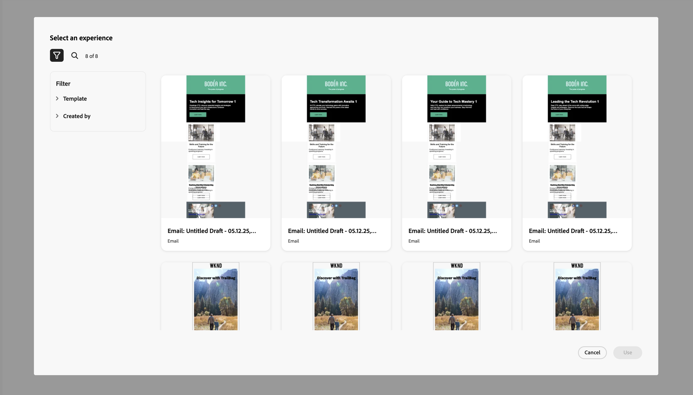

# 适用于Marketo Engage的GenStudio集成 {#genstudio-integration-for-marketo-engage}

Adobe GenStudio for Performance Marketing是一个创作、人工智能优先的应用程序，可让您创建自己的广告和电子邮件，以推动有影响力的个性化营销活动，从而满足您的品牌标准并遵守您的企业策略。 它提供了一系列工具，简化了内容创建的复杂性。

>[!INFO]
>
>了解有关[GenStudio for Performance Marketing](https://experienceleague.adobe.com/zh-hans/docs/genstudio-for-performance-marketing/user-guide/home){target="_blank"}的更多信息。

## 利用Marketo Engage中的GenStudio功能 {#leverage-genstudio-capabilities}

借助此集成，使用Marketo Engage开发和自动化电子邮件促销活动的技术营销人员可以与使用GenStudio创建内容的性能营销人员协作。 这使得他们可以轻松地将GenStudio中的品牌上内容集成到Marketo Engage中。

## 将HTML模板从Marketo Engage导出到GenStudio {#export-an-html-template}

轻松将包含品牌准则的模板导出到GenStudio for Performance Marketing。

1. 在Marketo Engage中，访问电子邮件的内容。

1. 在电子邮件Designer中，单击&#x200B;**更多**&#x200B;按钮，然后选择&#x200B;**导出HTML**。

   

1. [将HTML](https://experienceleague.adobe.com/zh-hans/docs/genstudio-for-performance-marketing/user-guide/content/templates/use-templates#templates-from-ajo-and-marketo){target="_blank"}导出的模板上载到GenStudio for Performance Marketing。

1. 在GenStudio中，使用此模板可[创建多个带有AI提示的电子邮件变体](https://experienceleague.adobe.com/zh-hans/docs/genstudio-for-performance-marketing/user-guide/create/create-email-experience){target="_blank"}并保存它们。

## 在Marketo Engage中利用GenStudio体验 {#leverage-genstudio-experiences}

要利用您通过将变体导入Marketo Engage而创建的GenStudio电子邮件变体，请执行以下步骤。

1. 在Marketo Engage中，[创建电子邮件](/help/marketo/product-docs/email-marketing/email-designer/email-authoring.md#create-an-email)。

1. 在电子邮件详细信息页面中，单击&#x200B;**编辑电子邮件内容**。

   

1. 选择&#x200B;**导入HTML**。

   

1. 单击&#x200B;**Adobe GenStudio for Performance Marketing**&#x200B;按钮。

   

1. 浏览GenStudio体验以开始构建您的内容。 您可以根据产品、角色、品牌甚至颜色等标准筛选体验。

1. 选择一个体验，然后单击&#x200B;**使用**。

   {width="800" zoomable="yes"}

1. 选定的内容显示在电子邮件Designer中。

   {width="800" zoomable="yes"}

>[!NOTE]
>
>从GenStudio模板创建的Marketo Engage体验直接导入到Email Designer中。 在兼容模式下导入的不带GenStudio模板创建的Marketo Engage体验。

使用[电子邮件内容编辑工具](/help/marketo/product-docs/email-marketing/email-designer/email-authoring.md#add-structure-and-content){target="_blank"}和[个性化字段](/help/marketo/product-docs/email-marketing/email-designer/email-authoring.md#personalize-content){target="_blank"}，根据需要编辑电子邮件。
