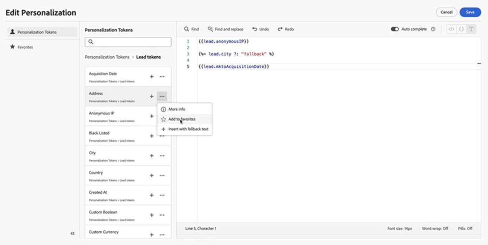

# Personalization令牌 {#personalization-tokens}

在电子邮件个性化令牌方面，电子邮件设计器的格式与经典电子邮件编辑器的格式不同。 实施此更改是为了改进与手柄栏脚本的兼容性并简化电子邮件创建过程。

>[!AVAILABILITY]
>
>从2025年5月23日开始，此功能将批量配置给Marketo Engage用户，每周更新一个区域。 在推出过程中，任何使用新电子邮件设计工具创建的电子邮件都会自动将现有令牌迁移到新格式。 通过此更新，所有令牌都将仅以英语提供。

## 主要用例 {#primary-use-case}

此增强功能主要使那些从[Velocity脚本](https://experienceleague.adobe.com/zh-hans/docs/marketo-developer/marketo/email-scripting){target="_blank"}转换到Handlebar脚本的用户受益。 新的电子邮件设计工具仅支持新的令牌格式。 更新的格式消除了空格并引入了修订的默认文本结构，从而确保更顺畅、更有效的脚本编写体验。

## 令牌体验 {#token-experience}

了解令牌体验，包括旧体验和新体验。

### 旧格式 {#old-format}

在经典电子邮件编辑器中，您可以添加带空格的令牌，如`lead.Anonymous IP`或`member.registration code`。 默认文本的格式为： `{{lead.City:default=fallback}}`

{width="800" zoomable="yes"}

### 新建格式 {#new-format}

在电子邮件设计器中，必须为令牌使用[驼峰式大小写](https://developer.mozilla.org/en-US/docs/Glossary/Camel_case)或下划线（例如，`lead.anonymousIP`或`member.registration_code`）。 默认文本的格式也更改为``。

{width="800" zoomable="yes"}

## 注意事项 {#things-to-note}

* 为便于创作，个性化编辑器还具有以下功能：

   * 撤消/重做
   * 查找/查找和替换

* 新的个性化编辑器支持以前在Marketo Engage中支持的所有&#x200B;**令牌。**
