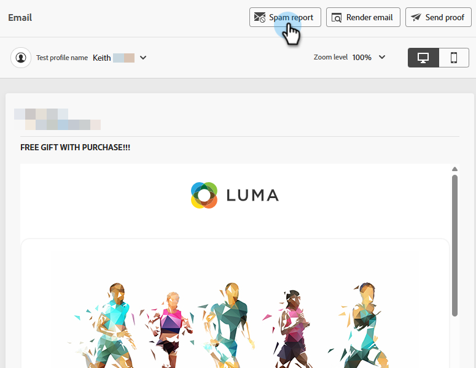

# 垃圾邮件报告 {#email-spam-report}

在Marketo Engage中使用SpamAssassin，您可以测试电子邮件内容并查看ISP/邮箱提供商将其标记为垃圾邮件的可能性。

SpamAssassin会分析您的内容并根据各种标准分配分数。 得分越低越好。保持低分很重要，因为发送高分电子邮件可能会对您的总体可投放性产生负面影响。

## 访问垃圾邮件报告 {#access-the-spam-report}

1. 在电子邮件中，单击&#x200B;**模拟内容**。

   {width="600" zoomable="yes"}

   >[!NOTE]
   >
   >如果您尚未添加测试用户档案，则必须在步骤1之后立即添加测试用户档案。

1. 单击&#x200B;**垃圾邮件报告**&#x200B;按钮。

   

1. 生成垃圾邮件报告。

   {width="600" zoomable="yes"}

1. 检查每个项目的得分和描述。

   >[!IMPORTANT]
   >
   >如果总体分数高于5，则您的电子邮件可能会在投放时被阻止或标记为垃圾邮件。

1. 如果您认为分数过高，请根据报告调查结果在电子邮件Designer中编辑您的内容，然后重新运行&#x200B;**垃圾邮件报告**。

   {width="800" zoomable="yes"}

当分数符合您的要求时，即可发送。

{width="800" zoomable="yes"}

>[!NOTE]
>
>垃圾邮件分数通过SpamAssassin获得，而规则不归Adobe所有。 有关这些规则的更多详细信息，请参阅[SpamAssassin文档](https://spamassassin.apache.org/#_blank){target="_blank"}。 可以在此处[查看错误](https://spamassassin.apache.org/old/tests_3_0_x.html){target="_blank"}的完整列表。
