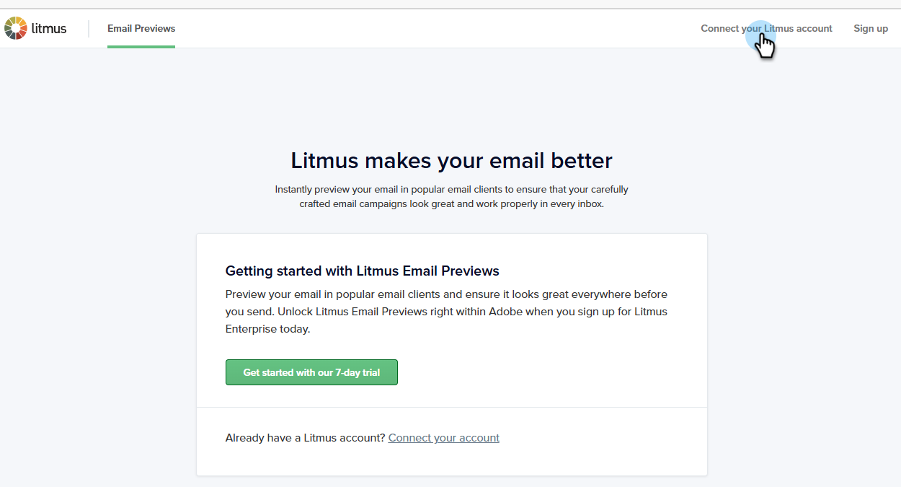
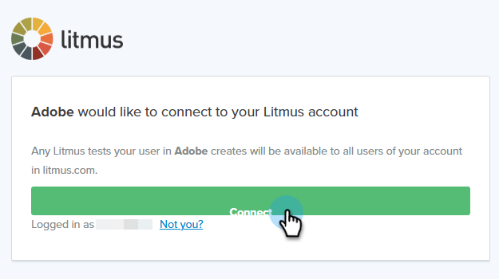

# 使用Litmus测试电子邮件渲染 {#test-email-rendering-with-litmus}

利用您在Marketo Engage中的[Litmus](https://www.litmus.com/email-testing)帐户，即时查看您的电子邮件在常用电子邮件客户端中的呈现方式。

>[!AVAILABILITY]
>
>此功能适用于在[企业计划](https://www.litmus.com/pricing/enterprise){target="_blank"}帐户上拥有活动Litmus帐户的所有Marketo Engage用户。

## 使用方法 {#how-to-use}

1. 在&#x200B;_编辑电子邮件内容_&#x200B;屏幕上，单击&#x200B;**模拟内容**&#x200B;按钮。

   

1. 选择测试收件人并单击&#x200B;**渲染电子邮件**&#x200B;按钮。

   {width="800" zoomable="yes"}

1. 如果尚未连接，请&#x200B;**连接您的Litmus帐户**。 如果您已经完成此操作，请跳至步骤6。

   {width="800" zoomable="yes"}

1. 输入您的Litmus凭据，然后单击&#x200B;**登录**。

   >[!IMPORTANT]
   >
   >将您的Litmus帐户连接到Marketo Engage时，您同意向Litmus发送测试电子邮件。 发送后，Adobe将不再管理这些测试电子邮件。 因此，Litmus数据保留电子邮件策略适用于这些电子邮件，包括可能包含在它们中的个性化数据。

1. 单击&#x200B;**连接**&#x200B;以完成集成。

   

1. 单击&#x200B;**运行测试**&#x200B;按钮以生成电子邮件预览。

1. 查看您的内容在常用桌面、移动设备和基于Web的电子邮件客户端中的外观。 单击任意所需数量的缩略图。

   {width="800" zoomable="yes"}

   >[!NOTE]
   >
   >了解如何[自定义您的默认电子邮件客户端列表](https://help.litmus.com/article/227-change-your-default-email-clients-list)。

1. 完成测试后，单击左上角的向后箭头返回&#x200B;_模拟内容_&#x200B;屏幕。

   

**可选步骤**：如果您决定更改电子邮件，在单击&#x200B;**渲染电子邮件**&#x200B;查看更改后，请务必也单击Litmus **电子邮件预览**&#x200B;屏幕右上角的&#x200B;_重新测试_&#x200B;按钮。

