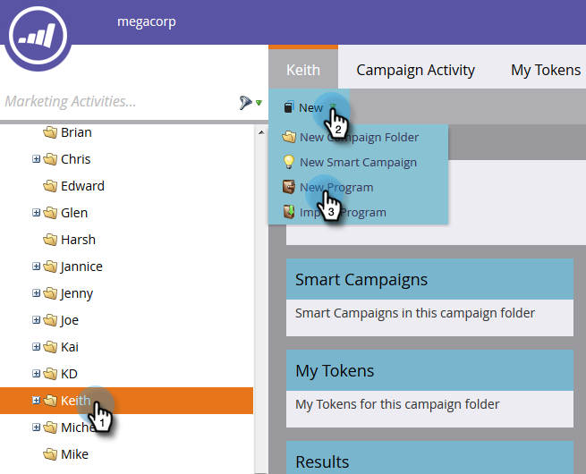

# 创建电子邮件项目{#create-an-email-program}

使用电子邮件项目快速轻松地向一组人员发送电子邮件。

1. 转到&#x200B;**营销活动**。

   

1. 选择要在中创建项目的文件夹，单击&#x200B;**新建**&#x200B;下拉框，然后选择&#x200B;**新建项目**。

   

1. 输入名称，选择&#x200B;**电子邮件**&#x200B;作为项目类型，然后单击&#x200B;**创建**。

   

   >[!NOTE]
   >
   >选择&#x200B;**Email**&#x200B;作为项目类型时，渠道将自动设置为&#x200B;**Email Send**。 您可以根据需要更改它。

   

不错！ 注意，项目现在在树中，可供使用。 下一步是定义您的受众。 请参阅下面的营销人员相关文章。

>[!MORELIKETHIS]
>
>* [使用智能受众定义列表](/help/marketo/product-docs/email-marketing/email-programs/managing-people-in-email-programs/define-an-audience-with-a-smart-list.md)
>* [通过导入受众定义列表](/help/marketo/product-docs/email-marketing/email-programs/managing-people-in-email-programs/define-an-audience-by-importing-a-list.md)

