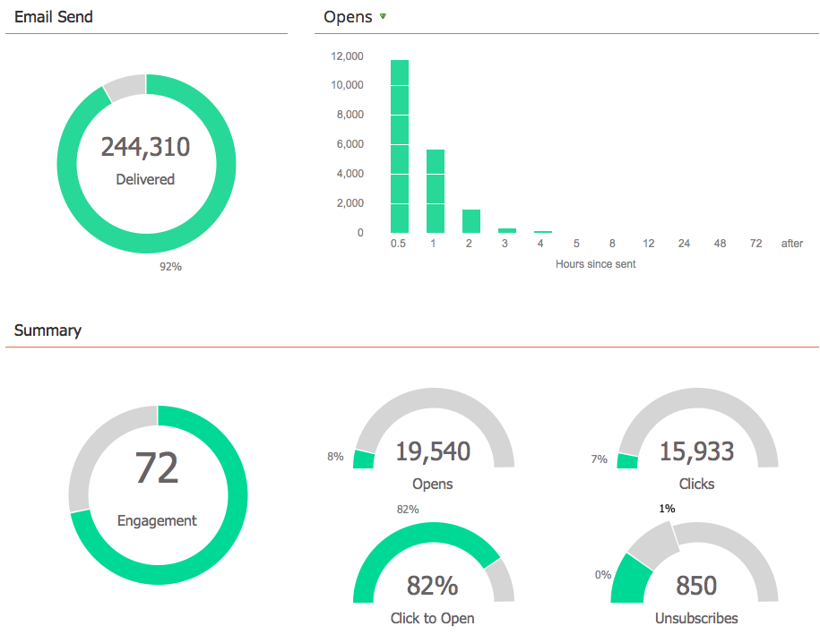

# 了解电子邮件项目{#understanding-email-programs}

向Marketo的新朋友打招呼，电子邮件项目。 发送电子邮件，创建A/B测试，并跟踪所有结果。

## 控制面板{#control-panel}

四个方框让您专注。 **受** 众定义“谁”, **** 电子邮件提供“什么”, **** Schedule定义“何时”, **** Approval使其准备就绪。

## A/B测试{#a-b-testing}

A/B测试使您能够证明哪种电子邮件最合适。

了解以下A/B测试：

* [“主题行”A/B测试](../../../../product-docs/email-marketing/email-programs/email-program-actions/email-test-a-b-test/use-subject-line-a-b-testing.md)
* [“完整电子邮件”A/B测试](../../../../product-docs/email-marketing/email-programs/email-program-actions/email-test-a-b-test/use-whole-email-a-b-testing.md)
* [“发件人地址”A/B测试](../../../../product-docs/email-marketing/email-programs/email-program-actions/email-test-a-b-test/use-from-address-a-b-testing.md)
* [“日期／时间”A/B测试](../../../../product-docs/email-marketing/email-programs/email-program-actions/email-test-a-b-test/use-date-time-a-b-testing.md)

## 仪表板{#dashboards}

>[!TIP]
>
>由于项目具有详细的报告仪表板，有些人更喜欢使用电子邮件项目，而不是通过智能活动发送电子邮件。

享受你的劳动成果。 仪表板向您显示电子邮件项目和A/B测试性能一览表。   

## 嵌套{#nesting}

电子邮件项目可以与其他项目很好地协作。

例如，使用电子邮件项目发送网络研讨会邀请。

在默认项目内使用电子邮件项目，以保持事项有序。

>[!TIP]
>
>要将现有电子邮件项目转换到其他项目，您必须克隆它。

>[!NOTE]
>
>电子邮件项目不能嵌套在[参与项目](../../../../getting-started/quick-wins/drip-drip-nurture.md)中。 也无法重新发送，一次只能运行一个测试。

## 计划设置{#schedule-settings}

了解电子邮件项目后，即可开始阅读以下相关文章之一！

>[!MORELIKETHIS]
>
>* [创建电子邮件项目](create-an-email-program.md)
   >
   >
* [使用智能受众定义列表](../../../../product-docs/email-marketing/email-programs/managing-people-in-email-programs/define-an-audience-with-a-smart-list.md)
>* [创建电子邮件项目](../../../../product-docs/email-marketing/email-programs/email-program-actions/create-an-email-for-an-email-program.md)
>* [计划电子邮件项目](../../../../product-docs/email-marketing/email-programs/email-program-actions/schedule-your-email-program.md)

>

