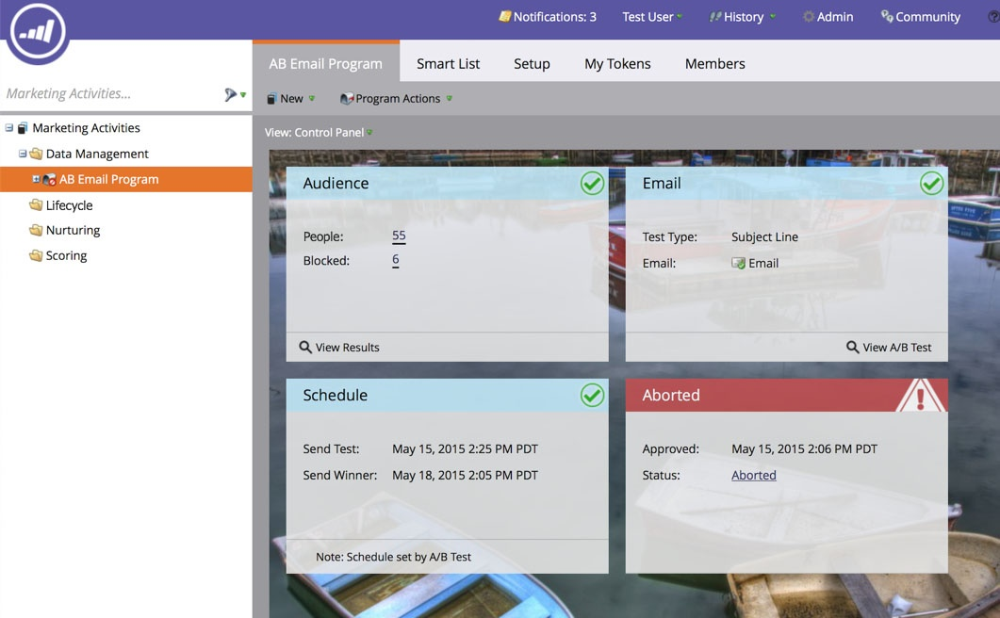

# 中止电子邮件项目{#abort-email-program}

哎呀！ 踩刹车！ 此电子邮件项目不应发出。

>[!NOTE]
>
>本文旨在帮助您防止电子邮件在发送前发出。 无法回忆已发送的电子邮件。

1. 在电子邮件项目中，单击&#x200B;**中止项目。**

   

1. 单击**中止**以获得完全确认。

   

1. 将显示警报标头，表示此电子邮件项目已中止。

   

   >[!CAUTION]
   >
   >电子邮件项目中止后，将无法重新计划。

哇！ 你难道不高兴你能避免那些代价高昂的错误吗？
