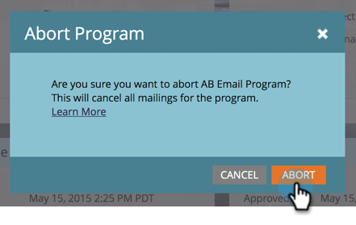

# 中止电子邮件程序 {#abort-email-program}

糟糕！ 踩刹车！ 此电子邮件程序不应退出。

>[!NOTE]
>
>本文旨在帮助您防止电子邮件在发送之前外发。 无法撤消已发送的电子邮件。

1. 在电子邮件程序中，单击 **中止程序**.

   

1. 单击 **中止** 进行完整确认。

   

1. 将显示一个警报标头，指出此电子邮件计划已中止。

   

   >[!CAUTION]
   >
   >一旦电子邮件程序中止，将无法重新计划该程序。

哇！ 你能避免那些代价高昂的错误吗？
