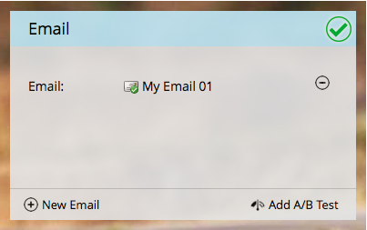

# 选择现有电子邮件{#choose-an-existing-email}

>[!PREREQUISITES]
>
>* [创建电子邮件项目](/help/marketo/product-docs/email-marketing/email-programs/creating-an-email-program/create-an-email-program.md)
>* [用智能存储器定义受众](/help/marketo/product-docs/email-marketing/email-programs/managing-people-in-email-programs/define-an-audience-with-a-smart-list.md) 通 [过导入列表来定义受众](/help/marketo/product-docs/email-marketing/email-programs/managing-people-in-email-programs/define-an-audience-by-importing-a-list.md)

[创建了电子邮件项目](/help/marketo/product-docs/email-marketing/email-programs/creating-an-email-program/create-an-email-program.md)并定义了受众后，您需要决定要发送的电子邮件。 您可以从头开始[为电子邮件项目](/help/marketo/product-docs/email-marketing/email-programs/email-program-actions/create-an-email-for-an-email-program.md)创建电子邮件，或选择已存在的电子邮件。 下面介绍如何选择已存在的。

1. 转到&#x200B;**营销活动**。

   

1. 查找并选择您的电子邮件项目。

   

1. 在&#x200B;**电子邮件**&#x200B;拼贴下，选择要发送的拼贴。

   

   >[!NOTE]
   >
   >只能选择本地电子邮件。 需要将电子邮件从一个项目移到另一个？ [了解详情](/help/marketo/product-docs/email-marketing/email-programs/email-program-actions/move-an-email.md)。

   真贴心！

   

既然我们已决定要发送什么电子邮件，我们可以设置A/B测试，或者跳过该测试，计划电子邮件项目。

>[!MORELIKETHIS]
>
>* [添加A/B测试](/help/marketo/product-docs/email-marketing/email-programs/email-program-actions/email-test-a-b-test/add-an-a-b-test.md)
>* [计划电子邮件项目](/help/marketo/product-docs/email-marketing/email-programs/email-program-actions/schedule-your-email-program.md)

