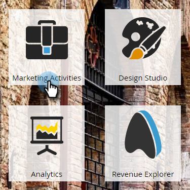
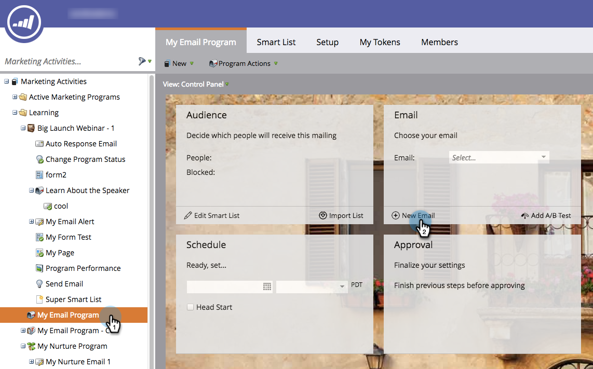
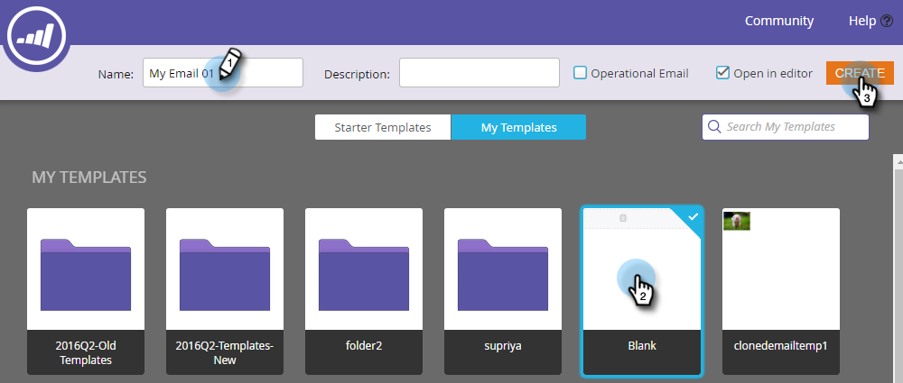
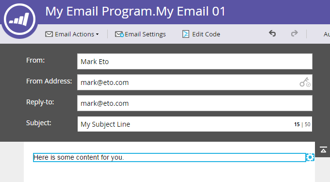
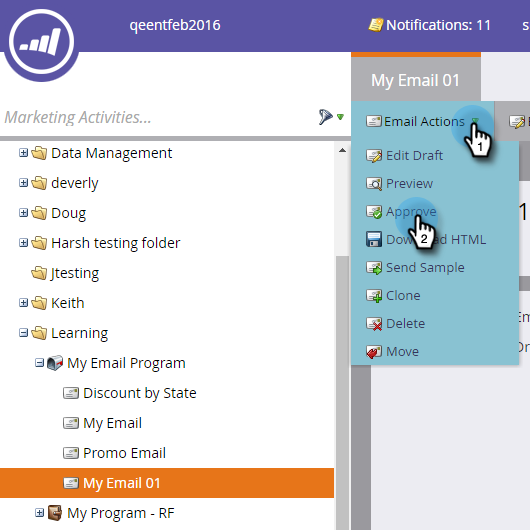

# 为电子邮件项目创建电子邮件 {#create-an-email-for-an-email-program}

>[!PREREQUISITES]
>
>* [创建电子邮件程序](/help/marketo/product-docs/email-marketing/email-programs/creating-an-email-program/create-an-email-program.md)
>* [使用智能列表定义受众](/help/marketo/product-docs/email-marketing/email-programs/managing-people-in-email-programs/define-an-audience-with-a-smart-list.md)或[通过导入列表定义受众](/help/marketo/product-docs/email-marketing/email-programs/managing-people-in-email-programs/define-an-audience-by-importing-a-list.md)

创建电子邮件程序并定义受众后，您将需要决定要发送的电子邮件。 您可以[选择现有电子邮件](/help/marketo/product-docs/email-marketing/email-programs/email-program-actions/choose-an-existing-email.md)或从头开始创建电子邮件。 以下是如何创建新电子邮件。

1. 前往 **[!UICONTROL Marketing Activities]**。

   

1. 选择您的电子邮件程序。 在&#x200B;**[!UICONTROL Email]**&#x200B;图块下，单击&#x200B;**[!UICONTROL New Email]**。

   

1. 输入&#x200B;**[!UICONTROL Name]**，选择您选择的模板并单击&#x200B;**[!UICONTROL Create]**。

   

1. 进行您想要的所有更改，然后关闭编辑器。

   

   >[!NOTE]
   >
   >了解如何[编辑电子邮件中的元素](/help/marketo/product-docs/email-marketing/general/email-editor-2/edit-elements-in-an-email.md)。

1. 别忘了批准您的电子邮件。

   

太棒了！ 现在我们已创建要发送的电子邮件，让我们[添加A/B测试](/help/marketo/product-docs/email-marketing/email-programs/email-program-actions/email-test-a-b-test/add-an-a-b-test.md)或直接跳至[计划您的电子邮件计划](/help/marketo/product-docs/email-marketing/email-programs/email-program-actions/schedule-your-email-program.md)。
