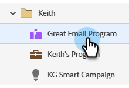

# 取消 A/B 测试 {#cancel-the-a-b-test}

如果您[已将A/B测试](/help/marketo/product-docs/email-marketing/email-programs/email-program-actions/email-test-a-b-test/add-an-a-b-test.md)添加到电子邮件计划中，并已决定不再需要它，则很容易撤消该测试。 操作方法如下：

1. 前往 **[!UICONTROL Marketing Activities]**。

   

1. 选择您的电子邮件程序。

   

1. 在&#x200B;**[!UICONTROL Email]**&#x200B;图块下，单击&#x200B;**[!UICONTROL Remove A/B Test]**。

   

   >[!NOTE]
   >
   >您的电子邮件程序必须未获批准，然后才能删除A/B测试。 有关详细信息，请参阅[批准/取消批准电子邮件计划](/help/marketo/product-docs/email-marketing/email-programs/email-program-actions/approve-unapprove-an-email-program.md)。
