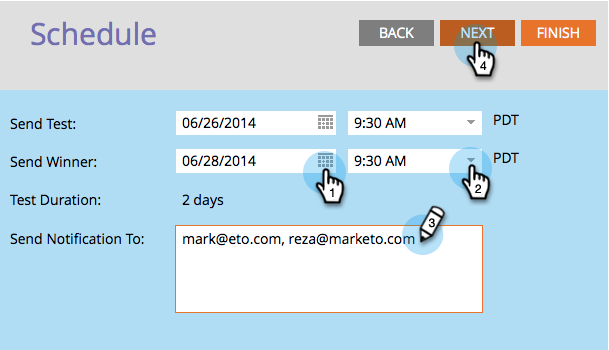
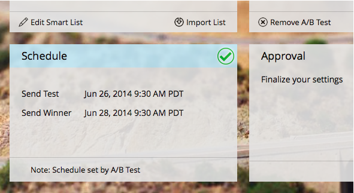

# 计划A/B测试 {#schedule-the-a-b-test}

在向电子邮件程序添加A/B测试并定义开始测试时需要安排的入选者标准后。 这是方法。

>[!PREREQUISITES]
>
>[添加A/B测试](/help/marketo/product-docs/email-marketing/email-programs/email-program-actions/email-test-a-b-test/add-an-a-b-test.md)

>[!NOTE]
>
>对于日期/时间测试，您只需在收到测试结果摘要时进行设置。

1. 选择 **发送测试** 日期。

1. 选择 **发送测试** 时间。

   

   >[!NOTE]
   >
   >“发送测试”和“发送入选者”至少间隔4小时。 但是，对于较大的发送，您可能需要等待24小时，以留出足够的时间来获得良好的结果。

1. 为了 **发送入选者**. 输入通知收件人（可选）并单击 **下一个**.

   >[!NOTE]
   >
   >只有测试组会接收测试变体。

   

   >[!NOTE]
   >
   >如果您选择手动声明入选者，则将定义 **报表发送** 日期/时间，而不是 **完成邮件** 日期/时间。

   超级！ 完成后，只需查看摘要并单击“关闭”。

   

   你会注意到 **计划** 磁贴现已更新。

   

   >[!NOTE]
   >
   >计划A/B测试还会配置最终发送日期或报表发送日期。

   如果您已经定义了受众并选择了电子邮件，则剩下的唯一步骤就是批准该项目。

   >[!MORELIKETHIS]
   >
   >[批准/取消批准电子邮件程序](/help/marketo/product-docs/email-marketing/email-programs/email-program-actions/approve-unapprove-an-email-program.md)
