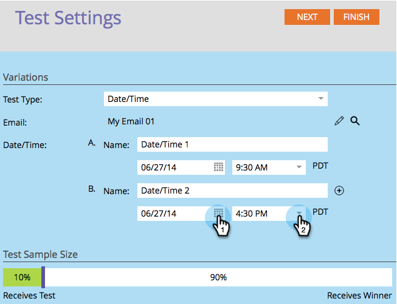

# 使用“日期/时间”A/B测试 {#use-date-time-a-b-testing}

您可以轻松对电子邮件进行A/B测试。 一个测试是 **日期/时间** 测试。 该测试在一天中的哪个时间或星期几最适合发送电子邮件。 下面是设置方法。

>[!PREREQUISITES]
>
>[添加A/B测试](/help/marketo/product-docs/email-marketing/email-programs/email-program-actions/email-test-a-b-test/add-an-a-b-test.md)
>

1. 在 **电子邮件** 图块，单击 **添加A/B测试**.

   

1. 此时将打开一个新窗口。 选择 **日期/时间** 对象 **测试类型**.

   

1. 如果您具有以前的测试信息（如主题测试），则可以安全地单击 **重置测试**.

   

1. 选择您的第一个日期/时间的日期。

   

1. 选择您的第一个日期/时间的时间。

   

1. 对第二个日期/时间执行相同操作。

   

1. 使用滑块选择要在A/B测试中显示的受众百分比，然后单击 **下一个**.

   

   >[!NOTE]
   >
   >不同的变体将应用于所选测试样本大小的相同部分。

   >[!CAUTION]
   >
   >**我们建议您避免将样本大小设置为100%**. 如果您使用静态列表，如果将样本大小设置为100%，则会向受众中的每个人发送电子邮件，并且入选者不会向任何人发送电子邮件。 如果您使用 **智能** 列表，将样本大小设置为100%会向受众中的每个人发送电子邮件 _当时_. 稍后当电子邮件程序再次运行时，任何符合智能列表条件的新用户也将收到电子邮件，因为他们现在包含在受众中。

   好吧，我们离这又近了一步。 现在我们需要 [定义A/B测试入选者标准](/help/marketo/product-docs/email-marketing/email-programs/email-program-actions/email-test-a-b-test/define-the-a-b-test-winner-criteria.md).
