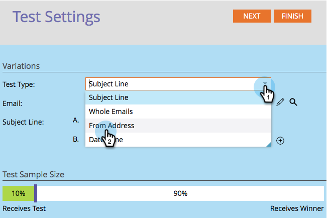

# 使用“发件人地址”A/B测试{#use-from-address-a-b-testing}

您可以轻松地对电子邮件进行A/B测试。 一个有趣的测试是&#x200B;**From Address**&#x200B;测试。 下面介绍如何设置。

>[!PREREQUISITES]
>
>[添加A/B测试](/help/marketo/product-docs/email-marketing/email-programs/email-program-actions/email-test-a-b-test/add-an-a-b-test.md)

1. 在&#x200B;**电子邮件**&#x200B;拼贴下，选择电子邮件，单击&#x200B;**添加A/B测试**。

   

1. 将打开一个新窗口，为&#x200B;**测试类型**&#x200B;选择&#x200B;**从地址**。

   

1. 如果您有以前的测试信息（如主题测试），可以安全地单击&#x200B;**重置测试**。

   

1. 输入要测试的第二个&#x200B;**发件人地址**&#x200B;信息。

   >[!NOTE]
   >
   >选择A将预填充选定电子邮件中包含的信息。

   

   >[!TIP]
   >
   >单击&#x200B;**+**&#x200B;可添加任意数量的“发件人地址”。

1. 使用滑块选择A/B测试中所需受众的百分比，然后单击&#x200B;**下一步**。

   

   >[!NOTE]
   >
   >不同的变量将发送到所选测试样本大小的等同部分。

   >[!CAUTION]
   >
   >**建议您避免将样本大小设置为100%**。如果您使用静态列表，将样本大小设置为100%会向受众中的每个人发送电子邮件，而获胜者将不向任何人发送。 如果您使用&#x200B;**smart**&#x200B;列表，将采样大小设置为100%会向受众&#x200B;_中的每个人发送电子邮件，此时_。 当电子邮件项目在以后的某个日期再次运行时，任何符合智能列表资格的新用户也会收到电子邮件，因为他们现在已包含在受众中。

   我们快到了。 现在，我们需要[定义A/B测试入选方标准](/help/marketo/product-docs/email-marketing/email-programs/email-program-actions/email-test-a-b-test/define-the-a-b-test-winner-criteria.md)。
