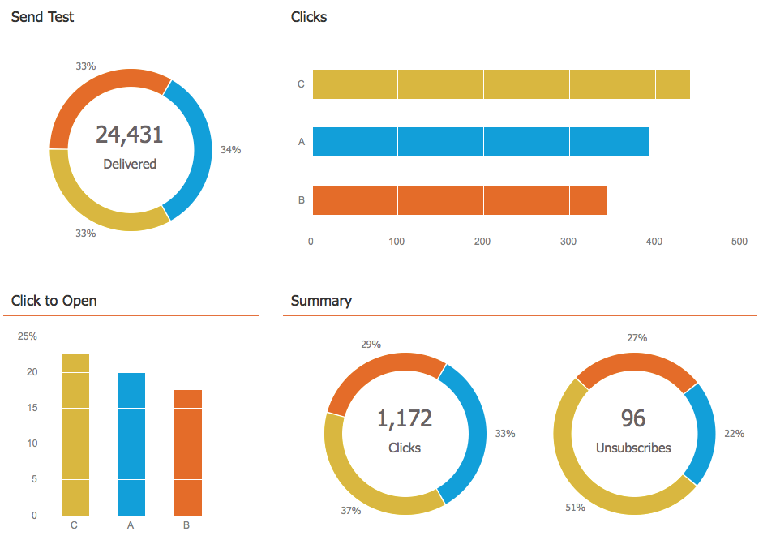
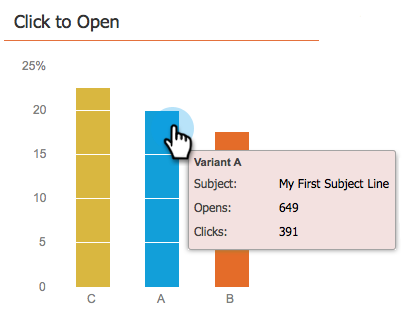

# 使用电子邮件项目仪表板 - A/B 测试视图 {#use-the-email-program-dashboard-a-b-test-view}

查看您的[电子邮件计划A/B测试](/help/marketo/product-docs/email-marketing/email-programs/email-program-actions/email-test-a-b-test/add-an-a-b-test.md)如何使用此仪表板。

## 发送测试 {#send-test}

在这里，您可以看到已投放的总量和按变体划分的明细。

## 点击次数 {#clicks}

在这里，您可以看到每个变体具有的点击量。

## 单击以打开 {#click-to-open}

此图显示了单击打开率。 （#次点击/#次打开）。

## 摘要 {#summary}

在这里，您可以按变体查看点击和取消订阅的细分，以便轻松进行比较。

很酷的仪表板，你不觉得吗？

>[!MORELIKETHIS]
>
>[使用电子邮件计划仪表板](/help/marketo/product-docs/email-marketing/email-programs/email-program-data/use-the-email-program-dashboard.md)
