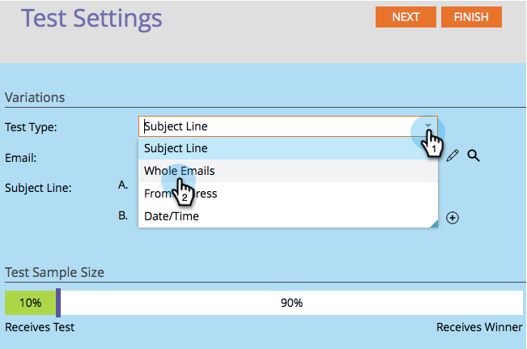

# 使用“整个电子邮件”A/B测试 {#use-whole-email-a-b-testing}

您可以轻松对电子邮件进行A/B测试。 一个很棒的考验是 **整个电子邮件** 测试。 下面是设置方法。

>[!PREREQUISITES]
>
>[添加A/B测试](/help/marketo/product-docs/email-marketing/email-programs/email-program-actions/email-test-a-b-test/add-an-a-b-test.md)

1. 在“电子邮件”图块下，选择您的电子邮件后，单击 **添加A/B测试**.

1. 此时将打开一个新窗口。 单击 **测试类型** 下拉并选择 **整个电子邮件**.

   

1. 如果您具有以前的测试信息（如主题测试），则可以安全地单击 **重置测试**.

   

1. 选择您的第一封电子邮件。

   

1. 单击 **添加** 以应用电子邮件。

   

   >[!TIP]
   >
   >您可以添加多个电子邮件。 但是，如果添加太多，可能会降低测试过程的速度。

1. 选择您的第二封电子邮件。

   

1. 单击 **添加** 以应用第二封电子邮件。 拖动滑块以选择要接收A/B测试的受众百分比，然后单击 **下一个**.

   

   >[!NOTE]
   >
   >不同的变体将发送到所选内容的相等部分 **测试样本大小**.

   >[!CAUTION]
   >
   >**我们建议您避免将样本大小设置为100%**. 如果您使用静态列表，如果将样本大小设置为100%，则会向受众中的每个人发送电子邮件，并且入选者不会向任何人发送电子邮件。 如果您使用 **智能** 列表，将样本大小设置为100%会向受众中的每个人发送电子邮件 _当时_. 稍后当电子邮件程序再次运行时，任何符合智能列表条件的新用户也将收到电子邮件，因为他们现在包含在受众中。

   好了，我们快到了。 现在我们需要 [定义A/B测试入选者标准](/help/marketo/product-docs/email-marketing/email-programs/email-program-actions/email-test-a-b-test/define-the-a-b-test-winner-criteria.md).
