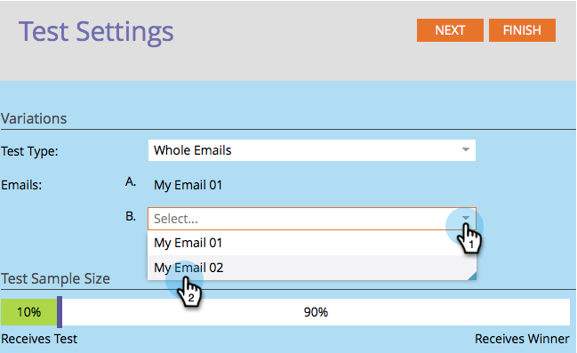

# 使用“整封电子邮件”A/B测试{#use-whole-email-a-b-testing}

您可以轻松地对电子邮件进行A/B测试。 一个极好的测试是&#x200B;**完整电子邮件**&#x200B;测试。 下面介绍如何设置。

>[!PREREQUISITES]
>
>* [添加A/B测试](add-an-a-b-test.md)

>

1. 在“电子邮件”拼贴下，选择电子邮件，单击“添加A/B测试”。

“ 

“

1. 将打开新窗口。 单击&#x200B;**测试类型**&#x200B;下拉框，然后选择&#x200B;**完整电子邮件**。

   

1. 如果您有以前的测试信息（如主题测试），可以安全地单击&#x200B;**重置测试**。

   

1. 选择您的第一封电子邮件。

   

1. 单击&#x200B;**添加**&#x200B;以应用电子邮件。

   “ 

   “

   >[!TIP]
   >
   >您可以添加多个电子邮件。 但是，如果添加过多，则可能会减慢测试过程。

1. 选择您的第二封电子邮件。

   “ 

   “

1. 单击&#x200B;**添加**&#x200B;以应用第二封电子邮件。 拖动滑块以选择要接收A/B测试的受众百分比，然后单击&#x200B;**下一步**。

   “ 

   “

   >[!NOTE]
   >
   >不同的变量将发送到所选&#x200B;**测试样本大小**&#x200B;的相等部分。

   >[!CAUTION]
   >
   >**建议您避免将样本大小设置为100%**。如果您使用静态列表，将样本大小设置为100%会向受众中的每个人发送电子邮件，而获胜者将不向任何人发送。 如果您使用&#x200B;**smart**&#x200B;列表，将示例大小设置为100%时会向受众中的每个人*发送电子邮件。 *当电子邮件项目在以后的某个日期再次运行时，符合智能列表资格的任何新用户也会收到电子邮件，因为他们现在已包含在受众中。

   我们快到了。 现在，我们需要[定义A/B测试入选方标准](define-the-a-b-test-winner-criteria.md)。

   >[!MORELIKETHIS]
   >
   >
   >    
   >    
   >    * [定义A/B测试入选方标准](define-the-a-b-test-winner-criteria.md)

