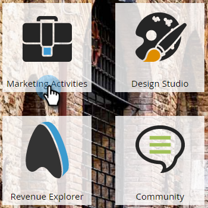

# 电子邮件项目的提前启动功能 {#head-start-for-email-programs}

>[!PREREQUISITES]
>
>[创建电子邮件程序](/help/marketo/product-docs/email-marketing/email-programs/creating-an-email-program/create-an-email-program.md)

当您为电子邮件程序选择日期/时间时，它会确定程序何时开始处理。 如果您希望电子邮件在选定的时间启动，则提前开始会通过提前处理程序为您提供该选项。

## 标准头开始 {#standard-head-start}

1. 单击 **[!UICONTROL Marketing Activities]**。

   

1. 查找并选择您的电子邮件程序。

   

   >[!NOTE]
   >
   >Head Start不能用于A/B测试。

1. 在[!UICONTROL Schedule]图块中，计划您的电子邮件，然后选择&#x200B;**[!UICONTROL Head Start]**&#x200B;框。

   

   选择[!UICONTROL Head Start]后，程序将在计划时间之前约12小时开始处理。 一旦处理开始，程序将被锁定。

   >[!CAUTION]
   >
   >受众中在程序锁定后取消订阅的任何人仍会收到电子邮件。 我们建议调整您的取消订阅通知，以反映取消订阅可能需要1 - 2个工作日才能处理。

1. 单击 **[!UICONTROL Approve Program]**。

   

   项目批准后，您可能会在批准拼贴上看到四种不同的状态。

   * **[!UICONTROL Waiting to run]：**&#x200B;项目获得批准后。
   * **[!UICONTROL Processing started, waiting to run]：**&#x200B;处理正在进行中。
   * **[!UICONTROL Processing finished, waiting to run]：**&#x200B;处理完成，电子邮件现在等待计划时间启动。
   * **[!UICONTROL Finished]：**&#x200B;项目已完成。

   >[!TIP]
   >
   >是否要在程序锁定后但在电子邮件发送前取消？ 没问题！ 只需单击“审批”拼贴右下角的&#x200B;**[!UICONTROL Abort Program]**。

   >[!NOTE]
   >
   >如果在电子邮件程序计划运行时间之前不到12小时未批准该程序，但随后改变了主意，您将需要选择一个至少比批准该程序提前12小时的新日期/时间。

## 以收件人时区开头的标题 {#head-start-with-recipient-time-zone}

我们现有的先发制人功能要求项目至少提前12小时计划。 这对收件人时区意味着什么？ 请记住，当收件人时区处于活动状态时，我们会在最早时区的午夜开始运行电子邮件程序(UTC +14:00)。 因此，要同时启用&#x200B;**&#x200B;**&#x200B;开头和收件人时区，计划的时间必须至少比最早时区(UTC +14 **)提前:00** 12小时。

这意味着如果您在美国/洛杉矶并且想要同时启用开头和收件人时区，则需要提前&#x200B;**34小时**&#x200B;计划该计划。 我们怎么找到这个号码的？

[了解更多](/help/marketo/product-docs/email-marketing/email-programs/email-program-actions/scheduling-with-recipient-time-zone/schedule-email-programs-with-recipient-time-zone.md)有关如何使用收件人时区计划电子邮件程序。

>[!MORELIKETHIS]
>
>* [计划您的电子邮件计划](/help/marketo/product-docs/email-marketing/email-programs/email-program-actions/schedule-your-email-program.md)
>* [计划具有收件人时区的电子邮件程序](/help/marketo/product-docs/email-marketing/email-programs/email-program-actions/scheduling-with-recipient-time-zone/schedule-email-programs-with-recipient-time-zone.md)
>* [了解收件人时区](/help/marketo/product-docs/email-marketing/email-programs/email-program-actions/scheduling-with-recipient-time-zone/understanding-recipient-time-zone.md)
