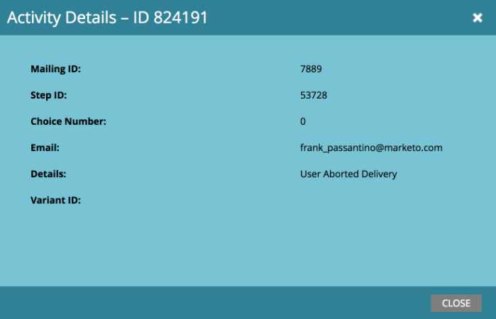

# 中止按收件人时区计划的电子邮件项目投放 {#abort-delivery-of-email-programs-scheduled-with-recipient-time-zone}

在紧急情况下，您可以中止已在启用收件人时区的情况下开始运行的电子邮件程序的投放。

由于使用收件人时区计划的电子邮件程序最多可以运行24小时，因此中止程序的交付将取消在该时间点之后发送的任何后续发送。

1. 选择要取消的电子邮件程序，然后单击 **中止投放** 在控制面板中的批准拼贴下。

   

1. 通过单击确认您要取消投放 **中止**.

   

1. 取消后， **结果** 您的电子邮件程序网格将类似于下面的网格。 任何后续发送均被取消，并将在 **活动类型** 列。

   

   >[!NOTE]
   >
   >取消的电子邮件将 **非** 显示为软退回 *直到* 按原计划在其各自时区交付的时间。 在此之前，它们仍会显示为“发送电子邮件”。

1. 在网格中，您可以单击任意电子邮件以查看活动详细信息。 对于已取消的发送，详细信息弹出窗口将如下所示：

   

>[!MORELIKETHIS]
>
>* [了解收件人时区](/help/marketo/product-docs/email-marketing/email-programs/email-program-actions/scheduling-with-recipient-time-zone/understanding-recipient-time-zone.md)
>* [按收件人时区计划电子邮件程序](/help/marketo/product-docs/email-marketing/email-programs/email-program-actions/scheduling-with-recipient-time-zone/schedule-email-programs-with-recipient-time-zone.md)
